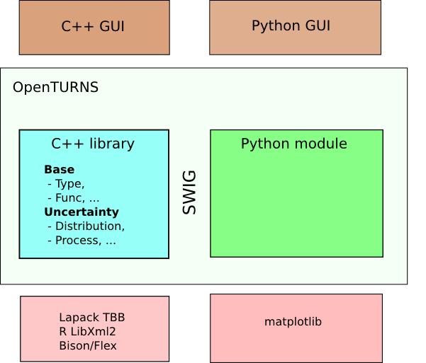
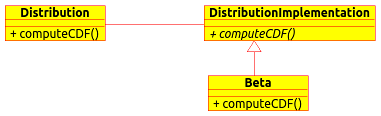
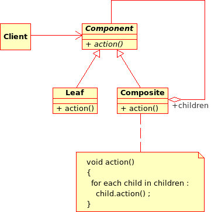

Architecture
============

The project is an open source project. It aims at developing a
computational platform designed to carry out industrial studies on
uncertainty processing and risk analysis.

This platform is intended to be released as an open source contribution
to a wide audience whose technical skills are very diverse. Another goal
of the project is to make the community of users ultimately responsible
for the platform and its evolution by contributing to its maintenance
and developing new functions.

This architecture specifications document therefore serves two purposes:

-  to provide the design principles that govern the platform, in order
   to guide the development teams in their development process;

-  to inform external users about the platform’s architecture and its
   design, in order to facilitate their first steps with the platform.

To address these questions, the  platform needs to be:

-  *portable*: the ability to build, execute and validate the
   application in different environments (operating system, hardware
   platform as well as software environment) based on a single set of
   source code files.

-  *extensible*: the possibility to add new functions to the application
   with a minimal impact on the existing code.

-  *upgradable*: the ability to control the impact of a replacement or a
   change on the technical architecture, following an upgrade of the
   technical infrastructure (such as the replacement of one tool by
   another or the use of a new storage format).

-  *durable*: the technical choices must have a lifespan comparable to
   the application’s while relying on standard and/or open source
   solutions.

Overview
--------

This chapter will describe the general design of and a few design models
that are widely used within the platform.

The core of the platform is a C++ library made of about 500
classes of various size.

The main user interface is a python module, automatically generated from
the C++ library using the wrapping software SWIG.
It allows for a usage through python scripts of any level of complexity.

The library relies on relatively few dependencies, (Lapack, R, TBB,
LibXml2), and most of them are optional.

Several GUIs have already been built on top of the C++ library or the
Python module.

A service of modules is provided in order to extend the capabilities of
the platform from the outside.

   Software architecture overview

The C++ library
~~~~~~~~~~~~~~~

A multi-layered library
^^^^^^^^^^^^^^^^^^^^^^^

The library has a multi-layered architecture materialized by the source
tree. The two main layers in the C++ library are the Base layer and the
Uncertainty layer.

-  Base layer: it contains all the classes not related to the
   probabilistic concepts. It covers the elementary data types (vectors
   as Point, samples as Samples), the concept of
   models (Function), the linear algebra (Matrix, Tensor)
   and the general interest classes (memory management, resource
   management);

-  Uncertainty layer: it contains all the classes that deal with
   probabilistic concepts. It covers the probabilistic modelling
   (Distribution, RandomVector), the stochastic algorithms (MonteCarlo,
   FORM), the statistical estimation (DistributionFactory), the
   statistical testing (FittingTest)

A class in the Uncertainty layer can use any class in the Base or the
Uncertainty layer. A class in the Base layer can ONLY USE classes in the
Base layer.

Resource management
^^^^^^^^^^^^^^^^^^^

OpenTURNS uses extensively dynamic memory allocation. In order to tie to
the Resource Acquisition Is Initialization (RAII) paradigm, all the
memory management is delegated to smart pointers (the Pointer class).
The benefits of this approach are:

-  An easy to implement copy on write mechanism, that permit a
   significant reduction of the memory footprint by allowing for a large
   data sharing between objects;

-  No C-like pointers in members of classes, which permits an automatic
   generation of the copy constructor, the assignment operator and the
   destructor of almost all the classes: there is no problem of deep
   copy versus reference copy;

-  The resource is released automatically when the objects are outside
   of the current scope and there is no more reference on the allocated
   memory;

-  There is a unique point where to prevent concurrent access in a
   parallel context, which is a key property for parallelism.

The Python module
~~~~~~~~~~~~~~~~~

| The binding of the library is done almost automatically by SWIG
  (Simplified Wrapper Interface Generator) through a set of SWIG
  interface files (.i).
| The main target language is python. These swig files contain some
  specific ’glue code’ to each class for the target script language.
  SWIG parses the library headers and theses swig interface files to
  generates the corresponding module source yet to be compiled to
  produce a binary python module, see [fig:swig]. The process is shared
  between several modules for modularity and to speed up compilation
  time with parallel builds.

.. figure:: Figures/design/swig.png
   :alt: Python module generation process

   Python module generation process

Software environment
--------------------

This section details the technical elements required by the OpenTURNS
platform, namely the system requirements, the tools and the development
environment of the project.

Target platforms
~~~~~~~~~~~~~~~~

The OpenTURNS platform is meant to carry out uncertainty treatment
studies in a scientific environment. Most of the scientific codes being
available on Unix platforms, OpenTURNS is naturally designed to run on
this family of systems. Unix being a standard with multiple
implementations, available on different architectures, this gives a wide
choice of target platforms.

Linux is currently the most attractive Unix system for the OpenTURNS
project, it was chosen as the main target system for the project’s
development as well as for the delivery of the different versions.

The partners involved in the project have each chosen different Linux
distributions, for technical and historical reasons. Therefore, it was
decided to support several distributions, a choice that should not be
seen as final or minimal. The distributions considered here include for
example this list:

+--------------------+-------------------+
| **Distribution**   | **Version**       |
+====================+===================+
| Debian             | 8 “Jessie”        |
+--------------------+-------------------+
| Ubuntu             | 14.04 “Trusty”    |
+--------------------+-------------------+
| Windows            | 7                 |
+--------------------+-------------------+

The primary development platform is Linux, and is known to work on
various other distributions.

The Windows version is obtained by cross-compilation using MinGW-w64.

.. _dependencies:

Dependencies
~~~~~~~~~~~~

The tools chosen for the development of the platform are:

+---------------------------------------+-----------------------------------------------------------+-------------------+
| **Category**                          | **Name**                                                  | **Version**       |
+=======================================+===========================================================+===================+
| Configuration                         | `CMake <https://cmake.org/>`_                             | 2.8.8             |
+---------------------------------------+-----------------------------------------------------------+-------------------+
| C/C++ compiler                        | `GCC <https://gcc.gnu.org/>`_                             | 3.3.5             |
+---------------------------------------+-----------------------------------------------------------+-------------------+
| Linear algebra                        | `BLAS <http://www.netlib.org/blas/>`_                     | 3.0               |
+---------------------------------------+-----------------------------------------------------------+-------------------+
| Linear algebra                        | `LAPACK <http://www.netlib.org/lapack/>`_                 | 3.0               |
+---------------------------------------+-----------------------------------------------------------+-------------------+
| Linear algebra (optional)             | `HMat <https://github.com/jeromerobert/hmat-oss>`_        | 1.2               |
+---------------------------------------+-----------------------------------------------------------+-------------------+
| Analytical parser (optional)          | `muParser <http://muparser.beltoforion.de/>`_             | 2.2.3             |
+---------------------------------------+-----------------------------------------------------------+-------------------+
| Special functions (optional)          | `Boost <http://www.boost.org/>`_                          | 1.46              |
+---------------------------------------+-----------------------------------------------------------+-------------------+
| Optimization (optional)               | `NLopt <http://ab-initio.mit.edu/nlopt>`_                 | 2.4               |
+---------------------------------------+-----------------------------------------------------------+-------------------+
| Optimization (optional)               | `OPT++ <https://software.sandia.gov/opt++/>`_             | 2.4               |
+---------------------------------------+-----------------------------------------------------------+-------------------+
| CSV parser (optional)                 | flex                                                      | 2.5.33            |
+---------------------------------------+-----------------------------------------------------------+-------------------+
| CSV parser (optional)                 | bison                                                     | 2.4               |
+---------------------------------------+-----------------------------------------------------------+-------------------+
| XML support (optional)                | `LibXml2 <http://xmlsoft.org/>`_                          | 2.6.27            |
+---------------------------------------+-----------------------------------------------------------+-------------------+
| Multithreading (optional)             | `TBB <http://www.threadingbuildingblocks.org/>`_          | 2                 |
+---------------------------------------+-----------------------------------------------------------+-------------------+
| Python support                        | `Python <http://www.python.org/>`_                        | 2.6               |
+---------------------------------------+-----------------------------------------------------------+-------------------+
| Plotting library (optional)           | `Matplotlib <http://matplotlib.org/>`_                    | 1.1               |
+---------------------------------------+-----------------------------------------------------------+-------------------+
| C++/Python wrapper                    | `SWIG <http://www.swig.org/>`_                            | 2.0.9             |
+---------------------------------------+-----------------------------------------------------------+-------------------+
| Statistics library (optional)         | R                                                         | 2.0.1             |
+---------------------------------------+-----------------------------------------------------------+-------------------+
| Version control                       | `Git <https://git-scm.com/>`_                             | 2.5               |
+---------------------------------------+-----------------------------------------------------------+-------------------+
| ReSt to HTML (optional for doc)       | `Sphinx <http://sphinx-doc.org/>`_                        | 1.1               |
+---------------------------------------+-----------------------------------------------------------+-------------------+
| Sphinx extension (optional for doc)   | `Numpydoc <https://github.com/numpy/numpydoc/>`_          | 0.4               |
+---------------------------------------+-----------------------------------------------------------+-------------------+
| Sphinx extension (optional for doc)   | `nbsphinx <http://nbsphinx.rtfd.io/>`_                    | N/A               |
+---------------------------------------+-----------------------------------------------------------+-------------------+
| Python notebook  (optional for doc)   | `IPython <https://ipython.org/>`_                         | N/A               |
+---------------------------------------+-----------------------------------------------------------+-------------------+
| psutil  (optional for coupling)       | `psutil <https://github.com/giampaolo/psutil/>`_          | N/A               |
+---------------------------------------+-----------------------------------------------------------+-------------------+

The versions given here are only meant as indications of minimum version and newer ones
may be used.

Compilation infrastructure
~~~~~~~~~~~~~~~~~~~~~~~~~~

The compilation infrastructure uses CMake, it covers:

-  The detection and configuration aspects of the platform;

-  The dependency management of the sources;

-  The generation of parallel makefiles;

-  The regression tests.

Version control
~~~~~~~~~~~~~~~

The project uses Git version-control system.
The code repositories are hosted on GitHub (https://github.com/openturns/).

Continuous integration
~~~~~~~~~~~~~~~~~~~~~~

The git code repository is monitored for changes by automated builds,
allowing developers to detect problems early.

Each pull-request on the GitHub code repository triggers continuous integration
jobs for the different target platforms to be run on several free
continuous integration services:

- CircleCI (https://circleci.com/) for Linux
- Travis (https://travis-ci.org/) for macOS
- AppVeyor (https://www.appveyor.com/) for Windows

Each of these jobs checks that the library can be successfully compiled and
that all unit tests pass. All jobs passing is one of the necessary conditions
for the code to be integrated.

Packaging
~~~~~~~~~

The team officially provides binaries for the Debian operating system,
and Windows. Note that is officially supported in Debian: it can be
installed easily from the debian software repositories. Packages
are also available for some RPM-based distributions such as
Fedora, CentOS and openSUSE.

Design patterns
---------------

Introduction
~~~~~~~~~~~~

Software design shows the recurrence of some patterns, whether within
the same piece of software or in several applications (which can differ
in many ways). These patterns have been catalogued, described and
implemented in numerous situations that prove their universality and
their ability to solve recurring problems that the software architect is
faced with.

The following sections give an overview intended as much for the
reader’s understanding of the document as to establish a common
vocabulary for software architect. The latter ones will find here
standard design diagrams applied to the specific case of , which can
help them better apprehend the tool’s specificities and the design and
implementation choices that were made.

.. _bridge_pattern:

Bridge pattern
~~~~~~~~~~~~~~

| The bridge pattern is a design pattern used in software engineering
  which is meant to “decouple an abstraction from its implementation so
  that the two can vary independently”. The bridge uses encapsulation,
  aggregation, and can use inheritance to separate responsibilities into
  different classes.
| When a class varies often, the features of object-oriented programming
  become very useful because changes to a program’s code can be made
  easily with minimal prior knowledge about the program. The bridge
  pattern is useful when both the class as well as what it does vary
  often. The class itself can be thought of as the implementation and
  what the class can do as the abstraction. The bridge pattern can also
  be thought of as two layers of abstraction.

This pattern is one of the most widely used in . Some examples are:

-  Drawable, that separate the generic high level interface of a
   drawable from the specific low level interface of the several
   drawable specializations;

-  Distribution, see [fig:bridge], that exposes a high level interface
   of the concept of probability distribution whereas the
   DistributionImplementation class exposes the low level interface of
   the same concept.

Singleton pattern
~~~~~~~~~~~~~~~~~

The Singleton is a pattern used to ensure that at any given time, there
is only one instance of a class (A); it provides an access point for
this unique instance.

This is implemented by creating a class (Singleton) with a static
private attribute (uniqueInstance) initialized with an instance of class
A and whose reference (or pointer) is returned by a static method
(instance). Figure [fig:singleton] illustrates the Singleton pattern.

.. figure:: Figures/modeling_notions/singleton.png
   :alt: Singleton structure.

It is a very common pattern that allows to find and share an object
(which must remain unique) in different portions of code. Examples of
such objects include shared hardware resources (standard output, error,
log, etc.), but also internal functions that cannot or must not be
duplicated (e.g. a random number generator). For example, the classes
ResourceMap and IdFactory follow this pattern.

Factory pattern
~~~~~~~~~~~~~~~

This pattern allows to define a unique interface for the creation of
objects belonging to a class hierarchy without knowing in advance their
exact type. Figure [fig:factory] illustrates this pattern. The creation
of the concrete object (ClassA or ClassB) is delegated to a sub-class
(ClassAFactory or ClassBFactory) which chooses the type of object to be
created and the strategy to be used to create it.

.. figure:: Figures/modeling_notions/factory.png
   :alt: Factory structure.

This pattern is often used to dynamically create objects belonging to
related types (e.g. to instantiate objects within a GUI according to the
user’s behavior). It can also be used to back up and read again a
document written in a file by automatically re-instantiating objects. It
is a pattern that makes code maintenance easier by clearly separating
the objects and their instantiation in distinct and parallel class
hierarchies. For example, the classes DistributionFactory,
ApproximationAlgorithmImplementationFactory, BasisSequenceFactory follow
this pattern.

Strategy pattern
~~~~~~~~~~~~~~~~

The Strategy pattern defines a family of algorithm and makes them
interchangeable as far as the client is concerned. Access to these
algorithms is provided by a unique interface which encapsulates the
algorithms’ implementation. Therefore, the implementation can change
without the client being aware of it.

.. figure:: Figures/modeling_notions/strategy.png
   :alt: Strategy structure.

This pattern is very useful to provide a client with different
implementations of an algorithm which are equivalent from a functional
point of view. It can be noted that the Factory pattern described
earlier makes use of the Strategy pattern. For example, the classes
ComparisonOperator, HistoryStrategy follow this pattern.

Composite pattern
~~~~~~~~~~~~~~~~~

The Composite pattern is used to organize objects into a tree structure
that represents the hierarchies between component and composite objects.
It hides the complex structure of the object from the client handling
the object.

The Composite pattern is an essential element of the design model for the platform.
It can be found in several modeling bricks, such as function composition (ComposedFunction)
random vector composition (CompositeRandomVector), joint distributions (ComposedDistribution), etc.
