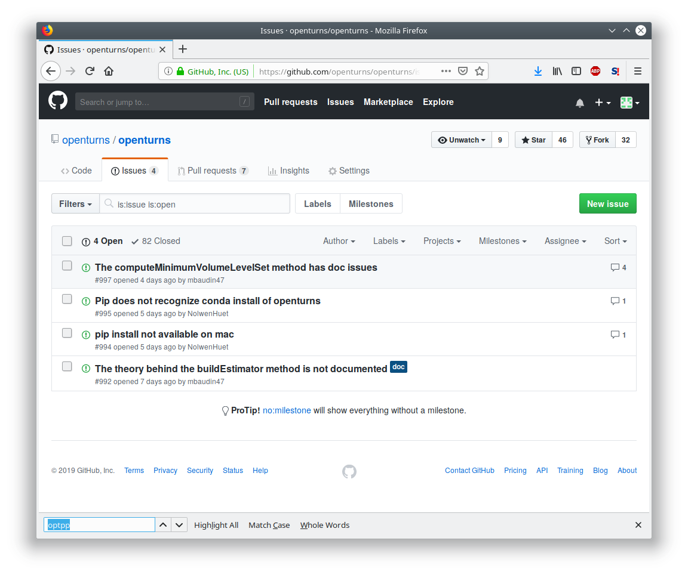

Library development
===================

This section provides informations on how to develop within the
perimeter of the library and it’s documentation.

If you are willing to contribute the actual development of the library, please
consider reading our coding guidelines and contact us on the developer's mailing list.

Install a development version
-----------------------------

Install the required dependencies
~~~~~~~~~~~~~~~~~~~~~~~~~~~~~~~~~

See :ref:`dependencies` for the system requirements.

Download openturns
~~~~~~~~~~~~~~~~~~

You can retrieve the development master branch through the git
repository by issuing the following command:

::

    git clone https://github.com/openturns/openturns.git
    cd openturns

Or, you can pick up a stable version tarball:

::

    curl -L https://github.com/openturns/openturns/archive/v1.12.tar.gz | tar xz
    cd openturns-1.12

Build openturns
~~~~~~~~~~~~~~~

::

    mkdir build
    cd build
    cmake -DCMAKE_INSTALL_PREFIX=$PWD/install ..
    make install -j4

Run tests
~~~~~~~~~

::

    make tests
    ctest -j4

and all the tests should be successful else check the log file
Testing/Temporary/LastTest.log.

Adding a single class to an existing directory
----------------------------------------------

This how-to explains the process that must be followed to fully
integrate a new class that provides an end-user facility (e.g. a new
distribution). We suppose that this class will take place in an existing
directory of the sources directories.

First, add the class to the C++ library
~~~~~~~~~~~~~~~~~~~~~~~~~~~~~~~~~~~~~~~

#. Create ``openturns/MyClass.hxx`` and ``MyClass.cxx`` in appropriate subdirectories of lib/src.
   The files must have the standard header comment, with a brief description
   of the class in Doxygen form and the standard reference to the LGPL license.

   For the header file ``MyClass.hxx``, the interface must be embraced
   between the preprocessing clauses:

   ::

       #ifndef OPENTURNS_MYCLASS_HXX
       #define OPENTURNS_MYCLASS_HXX

       BEGIN_NAMESPACE_OPENTURNS

       class OT_API MyClass
       {
       CLASSNAME;

       public:
         // default constructor
         MyClass();
       ...
       };

       END_NAMESPACE_OPENTURNS

       #endif // OPENTURNS_MYCLASS_HXX

   to prevent from multiple inclusions.

   See any pair of .hxx/.cxx files in the current directory and the PGQL
   document for the  coding rules: case convention for the static
   methods, the methods and the attributes, trailing underscore for the
   attribute names for naming a few.

#. Modify the ``CMakeLists.txt`` file in the directory containing
   ``MyClass.hxx`` and ``MyClass.cxx``:

   -  add ``MyClass.hxx`` to the headers using
      ``ot_install_header_file ( MyClass.hxx )``.

   -  add ``MyClass.cxx`` to the sources using
      ``ot_add_source_file ( MyClass.cxx )``.

#. Add ``MyClass.hxx`` to the file ``OTXXXXXX.hxx``, where ``XXXXXX`` is
   the name of the current directory.

#. Create a test file ``t_MyClass_std.cxx`` in the directory lib/test.
   This test file must use the standard functionalities of the class
   MyClass.

#. Create an expected output file ``t_MyClass_std.expout`` that contains
   a verbatim copy of the expected output (copy-paste the *validated*
   output of the test in this file).

#. Modify the ``CMakeLists.txt`` file in lib/test: add
   ``ot_check_test ( MyClass_std )`` in this file.

#. If the validation of your class involved advanced mathematics, or was
   a significant work using other tools, you can add this validation in
   the validation/src directory.

   -  copy all of your files in the validation/src directory.

   -  modify the validation/src/CMakeLists.txt file by appending the
      list of your files to the list of files to install.

#. You may want to update the Changelog file to mention new classes, bug fixes...

That’s it! Your class is integrated to the library and will be checked
for non-regression in all the subsequent versions of OpenTURNS, assuming
that your contribution has been incorporated in the “official”  release.
But nobody can use it!

Second, add your class to the Python interface
~~~~~~~~~~~~~~~~~~~~~~~~~~~~~~~~~~~~~~~~~~~~~~

#. Create MyClass.i in the python/src directory. In most situations, it
   should be:

   ::

       // SWIG file MyClass.i

       %{
       #include "openturns/MyClass.hxx"
       %}

       %include MyClass_doc.i

       %include openturns/MyClass.hxx
       namespace OT {
       %extend MyClass {

       MyClass(const MyClass & other)
       {
       return new OT::MyClass(other);
       }

       } // MyClass
       } // OT

#. Create MyClass\_doc.i.in docstring documentation in the python/src
   directory. This will be part of the HTML documentation generated by
   sphinx. Document every method of your class that’s not inherited. In
   most situations, it should look like this:

   ::

       %feature("docstring") OT::MyClass
       "MyClass class.

       Available constructors:
           MyClass()

           MyClass(*designPoint, limitStateVariable, isInFailureSpace*)

       Notes
       -----
       Structure created by the method run() of a :class:`~openturns.Analytical`
       and obtained thanks to the method *getAnalyticalResult*.

       Parameters
       ----------
       designPoint : float sequence
           Design point in the standard space resulting from the optimization
           algorithm.
       limitStateVariable : :class:`~openturns.Event`
           Event of which the probability is calculated.
       isInFailureSpace : bool
           Indicates whether the origin of the standard space is in the failure space.

       Examples
       --------
       >>> import openturns as ot
       >>> dp = ot.Normal().getRealization()
       >>> inst = ot.MyClass(dp, 4.8)
       >>> print(inst)"

       // ---------------------------------------------------------------------

       %feature("docstring") OT::MyClass::foo_method
       "...
       "

       // ---------------------------------------------------------------------

       ...

#. Modify the CMakeLists.txt file in python/src: add MyClass.i,
   MyClass\_doc.i.in to the relevant ``ot_add_python_module`` clause.

#. Locate and modify the file yyyy.i, where yyyy is the name of the
   python module related to MyClass, to include MyClass.i in the correct
   set of .i files (see the comments in yyyy.i file). In order to
   identify the correct python module, remember that the modules map
   quite closely the source tree organization.

#. Create a test file ``t_MyClass_std.py`` in the directory python/test.
   This test implements the same tests than ``t_MyClass_std.cxx``, but
   using python.

#. Modify the CMakeLists.txt file in python/test:

   -  add ``t_MyClass_std.py`` to the tests using
      ``ot_pyinstallcheck_test ( MyClass_std )``.

Document your contribution more thoroughly
~~~~~~~~~~~~~~~~~~~~~~~~~~~~~~~~~~~~~~~~~~

If your class introduces important mathematical concepts or impacts the
library architecture it may be useful to add some more details in the
documentation, see :ref:`sphinx_doc`.

That’s all, folks!

Some timings from an  Guru: 2 days of work for the most trivial
contribution (a copy-paste of a class with 5 methods, no mathematical or
algorithmic tricks). For a well-trained  contributor, a user-visible
class with a dozen of methods and well-understood algorithms, a new
class should not be less than a week of work...

Adding a set of classes in a new subdirectory
---------------------------------------------

This how-to explains the process that must be followed to fully
integrate a set of classes that provides an end-user facility (e.g. a
new simulation algorithm) developed in a new subdirectory of the
existing sources. The task is very similar to the steps described in the
how-to, only the new steps will be described. We suppose
that the subdirectory has already been created, as well as the several
source files. There are three new steps in addition to those of the
how-to: the creation of the cmake infrastructure in the
new subdirectory, the modification of the infrastructure in the parent
directory and the modification of the infrastructure in the root
directory.

CMake infrastructure in the parent subdirectory
~~~~~~~~~~~~~~~~~~~~~~~~~~~~~~~~~~~~~~~~~~~~~~~

You have to set up the recursive call of Makefiles from a parent
directory to its subdirectories, and to aggregate the libraries related
to the subdirectories into the library associated to the parent
directory:

#. add NewDir subdirectory to the build:

   ::

       add_subdirectory (NewDir)

CMake infrastructure in the new subdirectory
~~~~~~~~~~~~~~~~~~~~~~~~~~~~~~~~~~~~~~~~~~~~

You have to create a CMakeLists.txt file. Its general structure is given
by the following template:

::

    #                                               -*- cmake -*-
    #
    #  CMakeLists.txt
    #
    #  Copyright 2005-2019 Airbus-EDF-IMACS-Phimeca
    #
    #  This library is free software: you can redistribute it and/or modify
    #  it under the terms of the GNU Lesser General Public License as published by
    #  the Free Software Foundation, either version 3 of the License, or
    #  (at your option) any later version.
    #
    #  This library is distributed in the hope that it will be useful,
    #  but WITHOUT ANY WARRANTY; without even the implied warranty of
    #  MERCHANTABILITY or FITNESS FOR A PARTICULAR PURPOSE.  See the
    #  GNU Lesser General Public License for more details.
    #
    #  You should have received a copy of the GNU Lesser General Public License
    #  along with this library.  If not, see <http://www.gnu.org/licenses/>.
    #

    # Register current directory files
    ot_add_current_dir_to_include_dirs ()

    ot_add_source_file (FirstFile.cxx)
    # ...
    ot_add_source_file (LastFile.cxx)

    ot_install_header_file (FirstFile.hxx)
    # ...
    ot_install_header_file (LastFile.hxx)

    # Recurse in subdirectories
    add_subdirectory (FirstDir)
    # ...
    add_subdirectory (LastDir)

Version control
---------------

The versioning system used for the development of the whole platform is Git.

The git repositories are hosted at `Gihub <https://github.com/openturns/openturns/>`_
where sources can be browsed.

Bug tracking
~~~~~~~~~~~~

GitHub’s tracker is called *Issues*, and has its own section in every repository.

The snapshot of the library `bug-tracker <https://github.com/openturns/openturns/issues>`_
shows the list of active tickets:

Each ticket features attributes to help classification, interactive
comments and file attachment. This snapshot exposes the details
of a ticket:

.. figure:: Figures/Tickets2.png
   :alt: GitHub interface: details of a ticket report

Other requirements
------------------

Namespace
~~~~~~~~~

All the classes of the library are accessible within a single namespace
named OT and aliased as OpenTURNS. It allows to insulate these classes
from classes from another project that could share the same name. Macros
are provided to enclose your code in the namespace as follow:

::

    BEGIN_NAMESPACE_OPENTURNS
    // code
    END_NAMESPACE_OPENTURNS

Internationalization
~~~~~~~~~~~~~~~~~~~~

The platform is meant to be widely distributed within the
scientific community revolving around probability and statistics, which
is essentially an international community. Therefore, the platform
should be designed so as to be adjustable to the users, particularly
those who do not speak English [1]_.

This involves not using any messages directly in the source code of the
platform, but rather to create a resource catalogue that can be loaded,
according to the locale setting of the user, when the application is
launched.

Another consequence of internationalization is the need for the Unicode
extended character set to be used for all strings.

Accessibility
~~~~~~~~~~~~~

The platform shall be accessible to disabled users. This has
implications on the ergonomics and the design of the User Interface,
particularly the GUI which should offer keyboard shortcuts for any
available function as well as keyboard-based (rather than mouse-based)
mechanisms to handle and select objects.

Profiling
~~~~~~~~~

`Flame Graphs <http://www.brendangregg.com/flamegraphs.html>`_ can help visualize
where your functions spends the most time. Here are some commands to profile your
code paths using the `perf <https://perf.wiki.kernel.org/index.php/Main_Page>`_ tool
and generate the associated graph with `FlameGraph <https://github.com/brendangregg/FlameGraph>`_.

.. figure:: Figures/perf_welch.png
   :alt: Flame graph of WelchFactory

First retrieve the graphing scripts:

::

    git clone https://github.com/brendangregg/FlameGraph.git /tmp/FlameGraph

You will need to build without parallelization and with debug flags:

::

    cmake -DUSE_TBB=OFF -DCMAKE_BUILD_TYPE=RelWithDebInfo -DCMAKE_CXX_FLAGS="-fno-omit-frame-pointer" .

You will also want to disable openblas threads or openmp at any other level:

::

    export OMP_NUM_THREADS=1

Now you are ready to profile your executable:

::

    perf record --call-graph dwarf -o /tmp/perf.data ./lib/test/t_WelchFactory_std

Some Linux distros prevent normal users from collecting stats, in that case:

::

    # echo "-1"  > /proc/sys/kernel/perf_event_paranoid
    # echo 0 > /proc/sys/kernel/kptr_restrict

At this point you should be able to generate the graph from the perf data:

::

    perf script -i /tmp/perf.data | /tmp/FlameGraph/stackcollapse-perf.pl | /tmp/FlameGraph/flamegraph.pl > /tmp/perf.svg

.. [1]
   English has been chosen as the native language for the platform.
