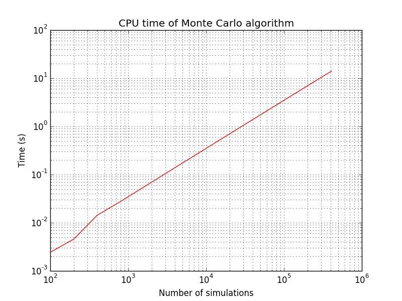
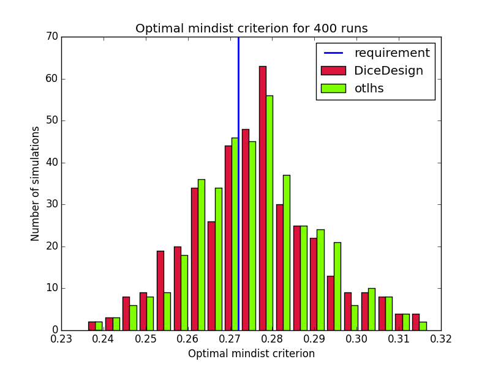
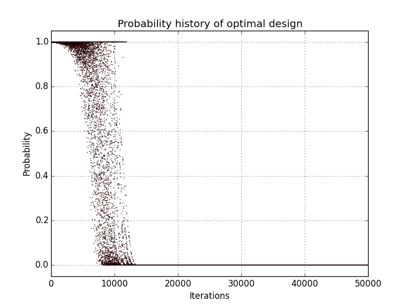
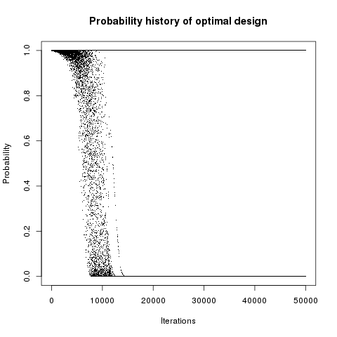
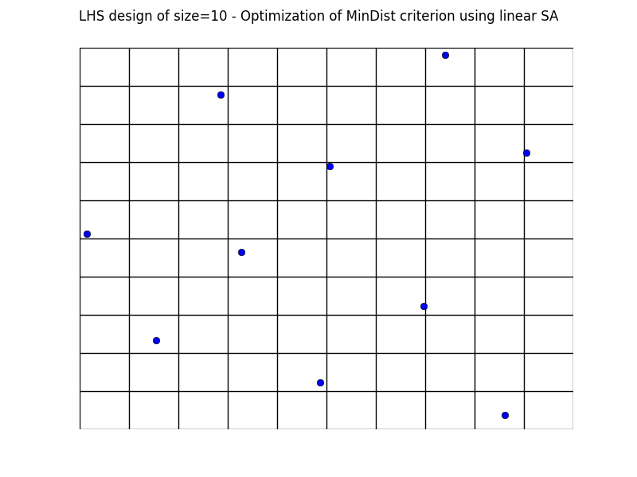
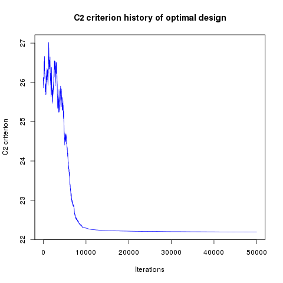

Optimal LHS
===========

Methodology of validation
-------------------------
Two different algorithms are implemented:

- Monte Carlo
- Simulated annealing algorithm; this algorithm is the novelty and requires several steps.

It uses also some tips such as the update of criterion after a permutation instead of a complete calculation.

Both algorithms are to be validated.


Preliminary validations
-----------------------
For specific designs, criteria values (:math:`C_2`, mindist and :math:`\phi_{p}`) obtained with otlhs module are compared with values computed by the DiceDesign R package.
Those scripts are located in the *validation* folder of this module.  Comparisons are very good, absolute error is less than :math:`10^{-13}`

As mentionned previously, :math:`C_2` criterion can be computed efficiently when a small perturbation is performed on design.
This specific method is compared to the DiceDesign's ones: absolute error is less or equal to :math:`10^{-10}`.

Note that for :math:`\phi_p` criterion, DiceDesign computes the new value after a permutation without taking into account the oldest criterion.
In this module, criterion update has been implemented, but is used only when parameter :math:`p \geq 5`. Indeed, numerical experiments have shown instability of the update when p becomes large.


Validation of Monte Carlo algorithm
-----------------------------------
To get an optimal design using Monte Carlo algorithm, several designs are to be
generated and the returned one minimizes the space filling function.

As the evaluation of the criterion does not require any complexity,
validation of Monte Carlo algorithm is trivial:

- Fix a criterion to minimize;
- Fix the RandomSeed to a fixed value (0 for example);
- Generate :math:`N=100` designs: get the optimal one and the associated criterion value;
- Fix again the RandomSeed;
- Generate :math:`N=10000` designs: get the optimal one and its associated criterion value;
- Check that the last criterion value is less or equal than to the previous one;


Validation of simulated annealing algorithm
-------------------------------------------
Simulated annealing is compared to Monte Carlo algorithm (with :math:`N=10000`)
and should return better results.
Indeed the optimal design is built such as the space filling criterion
decreases at each iteration.

Several use cases are proposed for the validation and illustrated hereafter:

========= =========== ====== ==================== ====================================== ================================
Test id   Dimension   Size   Temperature profile  Profile parameters                     Requirement
========= =========== ====== ==================== ====================================== ================================
1         2           10     Geometric            T_0=10, c=0.999, iMax=50000            :math:`C_2 \leq 0.0664`
2         2           10     Linear               T_0=10, iMax=50000                     :math:`mindist \geq 0.272`
3         50          100    Geometric            T_0=10, c=0.999, iMax=50000            :math:`C_2 \leq 22.176`
4         50          100    Geometric            T_0=10, c=0.999, iMax=50000            :math:`mindist \geq 2.653`
========= =========== ====== ==================== ====================================== ================================

Final criteria should meet requirements.

Results
-------
Designs are generated according to the multivariate distribution :math:`U[0,1]^d`.

MonteCarlo results
``````````````````

We first check that Monte Carlo scales linearly with respect to the number of simulations.
Random generator seed is reinitialized to the same value when starting Monte Carlo algorithm, this is why criterion always decreases.

.. figure:: lhs_mc_criterion.png
    :scale: 45 %



Tests corresponding to use cases in previous table are implemented and results obtained using Monte Carlo after :math:`N_{simu}=10000` simulations are given here:

========== ===== ============  ================ ============= ===============================
Dimension  Size  Criterion     Criterion value  CPU time (s)  Requirement
========== ===== ============  ================ ============= ===============================
2          10    :math:`C_2`   0.0643           0.72          :math:`C_2 \leq 0.0664`
2          10    mindist       0.2666           0.47          :math:`mindist \geq 0.272`
50         100   :math:`C_2`   24.427           109.48        :math:`C_2 \leq 22.176`
50         100   mindist       2.198            53.36         :math:`mindist \geq 2.653`
========== ===== ============  ================ ============= ===============================

We use :math:`N_{simu}=10000` simulations in order to get the optimal design (designs are not centered).
As shown here, :math:`N_{simu}=10000` iterations give a good solution for the small case;
but it the larger case, it is expected that this number is way too small, so results are quite close to expectations.

.. figure:: lhs_mc_c2_10.png
    :scale: 35 %

.. figure:: lhs_mc_mindist_10.png
    :scale: 35 %


Simulated annealing results
```````````````````````````

Using the :class:`otlhs.SimulatedAnnealingLHS` class, tests are implemented and results are summuarized here:
These are compared to those produced by DiceDesign R package in terms of criteria and CPU time:

======== =========================== =============== ============== =============== ==============
|                                     otlhs                          R
------------------------------------ ------------------------------ ------------------------------
Test id  Requirement                 Criterion       CPU time (s)   Criterion       CPU time (s)
======== =========================== =============== ============== =============== ==============
1        :math:`C_2 \leq 0.0664`     0.0699          0.04           0.06153         89.8
2        :math:`mindist \geq 0.272`  0.254           0.246          0.258           36.37
3        :math:`C_2 \leq 22.176`     22.190          2.69           22.15           618.7
4        :math:`mindist \geq 2.653`  2.643           55.8           2.64            220.6
======== =========================== =============== ============== =============== ==============

CPU time is much lower with otlhs.
It must be noted that speedup of test 4 is not in par with speedups of other tests.
We believe that this is not due to some performance problems, but is the combination of several factors:

- R implementation of mindist is better than C2 because it does not contain loops, but only few high-level operations on matrices.
- In otlhs implementations, mindist is slower than C2 because it calls evaluate instead of perturbLHS.

It may be interesting to try with p=5 instead of p=50, mindist would then be as fast as C2, and many restarts could be tried.
Unfortunately, we did not have time to make these tests.

Results are close to expectations, but do not meet all requirements.
In order to understand why otlhs results are sometimes out of bounds,
we performed 400 runs of tests 1 and 2 with DiceDesign and otlhs, 40 runs
of test 3 and 80 runs of test 4.
Diagrams look similar, thus in our opinion, otlhs does meet requirements.
Moreover, as otlhs is much faster than R, the same CPU budget will give better results with otlhs.

Comparison on 400 runs for test id 1:

.. figure:: comp_c2_small.png
    :scale: 40 %

Comparison on 400 runs for test id 2:



Comparison on 40 runs for test id 3:

.. figure:: comp_c2_large.png
    :scale: 40 %

Comparison on 80 runs for test id 4:

.. figure:: comp_mindist_large.png
    :scale: 40 %

In addition, designs, optimized criterion convergence and elementary perturbation probability are given here:
(for dimension 50, only criterion history is displayed).

Simulated annealing results - Test id 1:

.. figure:: lhs_sa_geom_10.png
    :scale: 45 %

.. figure:: dice_lhs_sa_geom_10.png
    :scale: 65 %

.. figure:: crit_sa_geom.png
    :scale: 45 %

.. figure:: dice_c2_crit.png
    :scale: 65 %





Simulated annealing results - Test id 2:



.. figure:: dice_lhs_sa_lin_10.png
    :scale: 65 %

.. figure:: crit_sa_lin.png
    :scale: 45 %

.. figure:: dice_mindist_crit.png
    :scale: 65 %

.. figure:: lhs_mindist_proba.png
    :scale: 45 %

.. figure:: dice_mindist_proba.png
    :scale: 65 %

Simulated annealing criterion results - Test id 3 and 4:

.. figure:: otlhs_c2_crit_big.png
    :scale: 45 %



.. figure:: otlhs_mindist_crit_big.png
    :scale: 45 %

.. figure:: dice_mindist_crit_big.png
    :scale: 65 %

Results are very similar between the two implementations.
It must be noted that there are many plots with probability 1.
The reason is that DiceDesign accepts both row indices to be equal when checking
for elementary perturbations.

