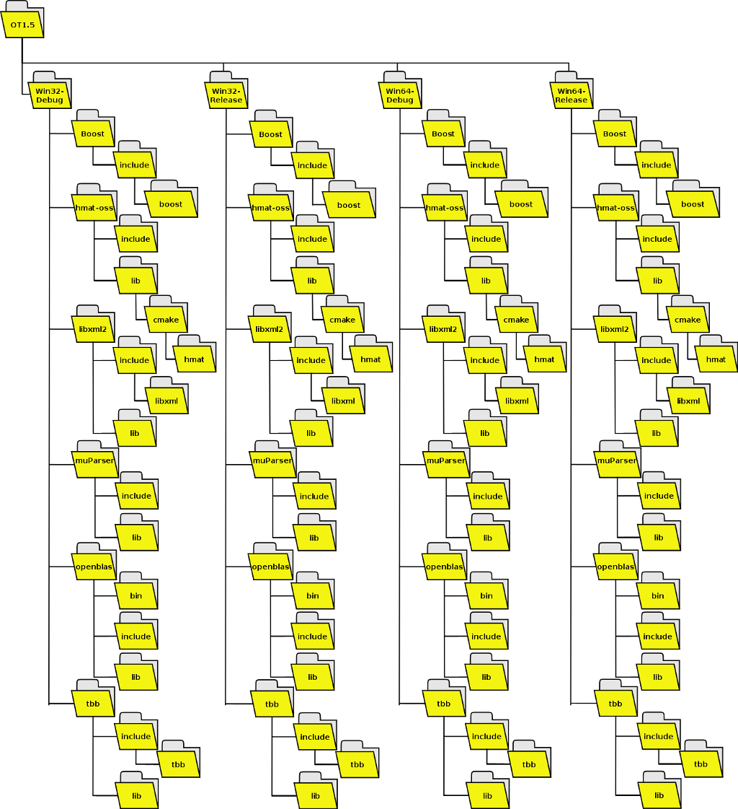
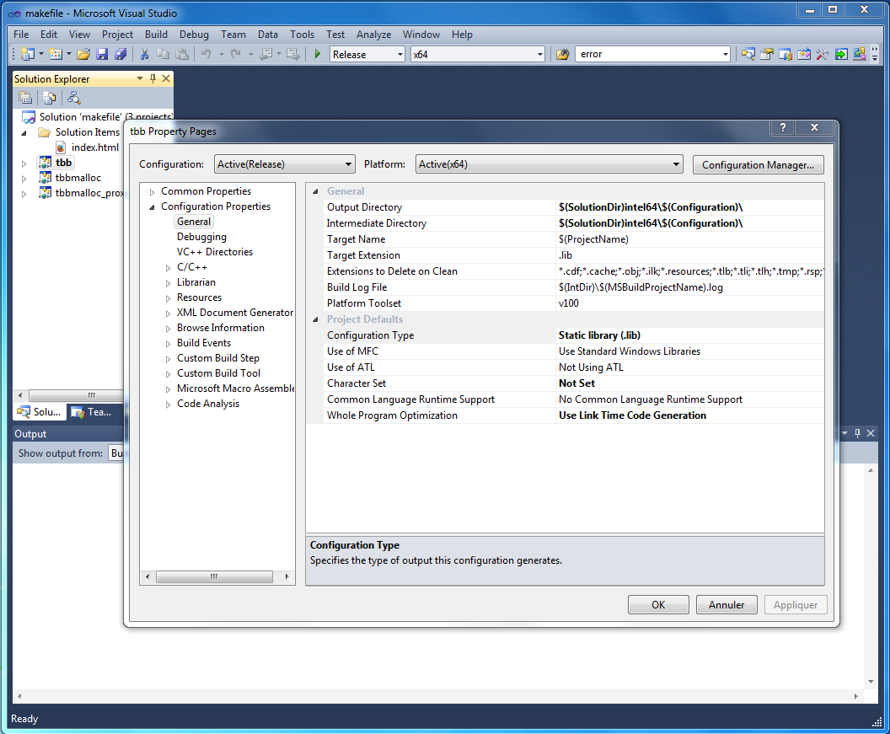
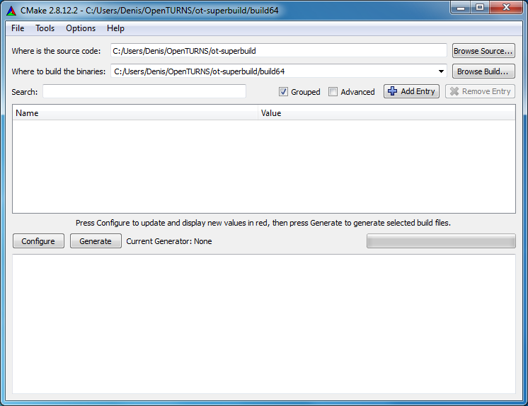
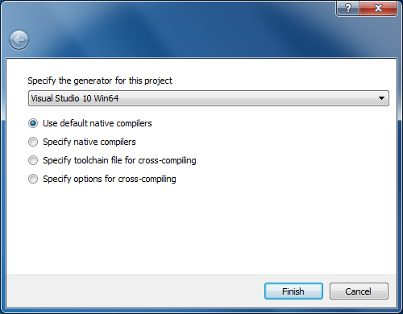
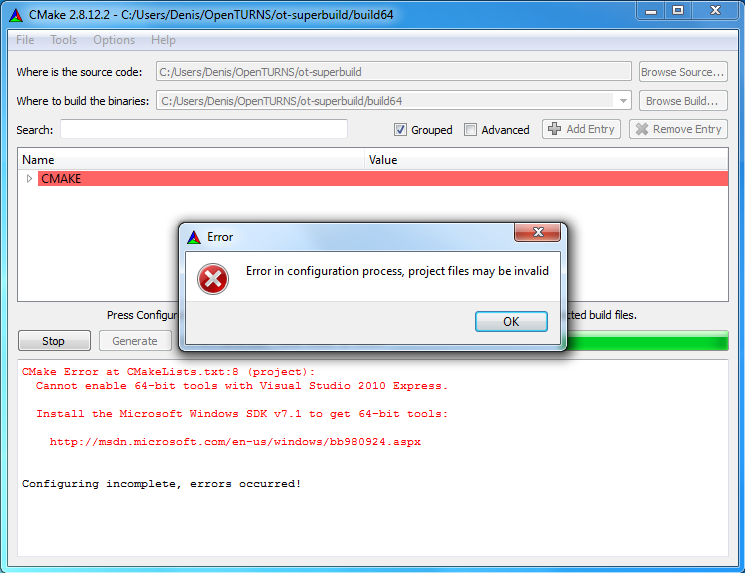
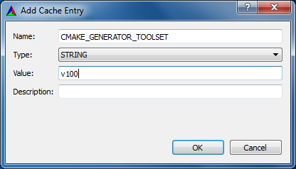
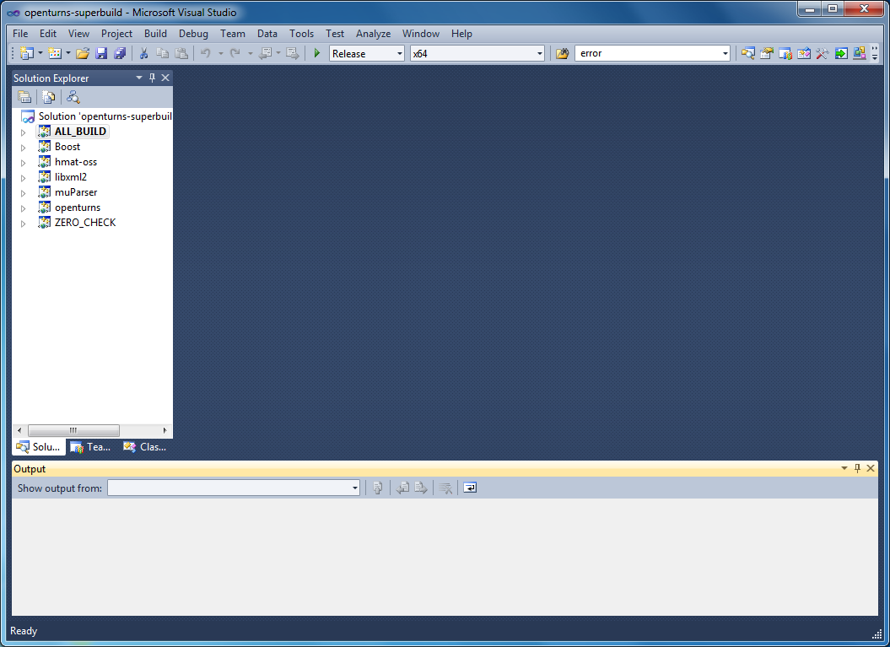

Windows native port
===================

The previous section explained how to cross-build OpenTURNS from Linux
to target Windows. This section gives hints in order to compile
OpenTURNS natively with Microsoft Windows tools. This port has started
since OpenTURNS 1.4 and is still in an early stage, any help from
developers who are familiar with Windows environment will be greatly
appreciated.

These instructions have been tested with Visual Studio 2010 on Windows
32 and 64 bits, but they should work with more recent versions too.
Visual Studio Express Edition does not ship 64 bits compilers, but they
can be installed from Windows SDKs, instructions can be easily found
online. No Fortran compiler is required.

Automatic compilation
---------------------

First of all, CMake must be installed, as well as C/C++ compilers. We
will describe below how to use CMake with Visual Studio and Microsoft
compilers, but CMake can also be used with other build systems (like
NMake, for instance) and other compilers, see CMake documentation for
further details.

The following programs are required in order to build OpenTURNS on
Windows:

-  `Boost <https://www.boost.org/>`_

-  `OpenBLAS <https://github.com/xianyi/OpenBLAS/>`_ (or any other BLAS
   implementation)

The following programs are optional, and we will show how to embed them
into OpenTURNS:

-  `hmat-oss <https://github.com/jeromerobert/hmat-oss/>`_

-  `LibXML2 <http://www.xmlsoft.org/>`_

-  `muParser <http://muparser.beltoforion.de/>`_

-  `TBB <https://www.threadingbuildingblocks.org/>`_

Precompiled binaries for all these programs are available on
http://sourceforge.net/projects/openturns/files/openturns/openturns-x.y.
If you want to recompile them from sources, you may also have to install

-  `Subversion <https://subversion.apache.org/>`_

-  `Git <http://git-scm.com/>`_

The following programs are optional, and are currently not used by this
native Windows port:

-  `R <http://www.r-project.org/>`_

-  `Python <http://www.python.org/>`_

Some OpenTURNS components will thus not be available. If R is installed
on your computer, you should edit ``openturns.conf`` and set
``R-executable-command`` resource in order to let OpenTURNS use it. On
the other hand, as OpenTURNS is built without Python bindings, Python
scripts cannot be used afterwards.

Installation layout
~~~~~~~~~~~~~~~~~~~

In this tutorial, OpenTURNS dependencies are installed by following the
layout shown in figure [fig:win-inst-layout]. Below the top-level
directory are four configurations (Debug and Release for Windows 32 bits
or 64 bits). Of course, if you are only interested by a single
configuration, there is no need to create others. Each configuration
contains subdirectories for Boost, hmat-oss, LibXML2, muParser, OpenBLAS
and TBB programs. Each project contains one or several directories:
``bin`` for DLLs, ``include`` for header files, and ``lib`` for static
libraries.

   Windows installation layout

For convenience, all libraries will be compiled as static libraries,
except OpenBLAS.

Build and install OpenBLAS and TBB
~~~~~~~~~~~~~~~~~~~~~~~~~~~~~~~~~~

For different reasons, OpenBLAS and TBB cannot be compiled along with
other dependencies. As explained on their site, OpenBLAS is currently
only supported on Windows with Mingw compiler. But binaries can be used
with Visual Studio, this is what we will do. Thus go to
http://sourceforge.net/projects/openblas/files/ and download Windows
binaries, for instance
``OpenBLAS-v0.2.13-Win32.zip`` for Windows 32 bits, or
``OpenBLAS-v0.2.13-Win64-int32.zip`` for Windows 64 bits.

Unzip these archives, and copy files to our installation folder:

-  | ``OpenBLAS-x.y-Win32\bin\libopenblas.dll`` into
     ``Win32-Release\openblas\bin\`` and
   | ``Win32-Debug\openblas\bin\``

-  | ``OpenBLAS-x.y-Win32\lib\libopenblas.dll.a`` into
     ``Win32-Release\openblas\lib\`` and
   | ``Win32-Debug\openblas\lib\``

-  | ``OpenBLAS-x.y-Win32\include`` into ``Win32-Release\openblas\`` and
   | ``Win32-Debug\openblas\``

-  | ``OpenBLAS-x.y-Win64-int32\bin\libopenblas.dll`` into
     ``Win64-Release\openblas\bin\`` and
   | ``Win64-Debug\openblas\bin\``

-  | ``OpenBLAS-x.y-Win64-int32\lib\libopenblas.dll.a`` into
     ``Win64-Release\openblas\lib\`` and
   | ``Win64-Debug\openblas\lib\``

-  | ``OpenBLAS-x.y-Win64-int32\include`` into
     ``Win64-Release\openblas\`` and
   | ``Win64-Debug\openblas\``

Note that DLLs have been compiled with Mingw, and require some Mingw
runtime libraries. They can be found in
http://sourceforge.net/projects/openblas/files/v0.2.12/mingw32_dll.zip
and
http://sourceforge.net/projects/openblas/files/v0.2.12/mingw64_dll.zip.
They are:

-  ``libgcc_s_sjlj-1.dll``, ``libgfortran-3.dll`` and
   ``libquadmath-0.dll`` for Win32

-  ``libgcc_s_seh-1.dll``, ``libgfortran-3.dll`` and
   ``libquadmath-0.dll`` for Win64

TBB comes with its own Visual Studio 2010 configuration file, but we did
not find how to integrate it into the build system described below. Thus
the easiest solution is to:

#. Download TBB sources from
   https://www.threadingbuildingblocks.org/download

#. Unpack it.

#. Launch ``build\vs2010\makefile.sln``

#. Select ``Win32`` or ``x64`` architecture, and ``Release`` or
   ``Debug`` configuration (not ``Release-MT`` or ``Debug-MT``, unless
   you know what you are doing).

#. If you want to build a static library, edit Properties, tab
   Configuration Properties, General, Configuration Type, as shown in
   figure [fig:vs-tbb-static]

#. Build project.

#. Copy resulting libraries into installation folder:

   -  ``build\vs2010\ia32\Debug\tbb_debug.lib`` into
      ``Win32-Debug\tbb\lib\``

   -  ``build\vs2010\ia32\Release\tbb.lib`` into
      ``Win32-Release\tbb\lib\``

   -  ``build\vs2010\intel64\Debug\tbb_debug.lib`` into
      ``Win64-Debug\tbb\lib\``

   -  ``build\vs2010\intel64\Release\tbb.lib`` into
      ``Win64-Release\tbb\lib\``

#. | Copy ``include\tbb`` folder into installation folders:
     ``Win32-Debug\tbb\include``,
   | ``Win32-Release\tbb\include``, ``Win64-Debug\tbb\include`` and
     ``Win64-Release\tbb\include``.

   Visual Studio settings to build tbb as a static library

Build and install OpenTURNS
~~~~~~~~~~~~~~~~~~~~~~~~~~~

OpenBLAS and TBB are low level libraries. Other libraries use STL, and
care must be taken to avoid mismatch between runtime libraries. To this
end, we decided to use a so called *SuperBuild* approach with CMake. We
defined a metaproject which drives compilation of those dependencies,
and also of OpenTURNS itself. Clone `ot-superbuild git repository
<https://bitbucket.org/dbarbier/ot-superbuild>`_ (or download an archive
from this URL), launch ``cmake-gui`` program, and follow the following
steps:

#. Launch ``cmake-gui``, and select source and build directories

#. Click on button. Select a generator (either Visual Studio 10 or
   Visual Studio 10 Win64) and compiler

#. For Win64, CMake may give an error about missing 64-bit tools, as in
   snapshot below. Visual Studio Express Edition does not embed 64-bit
   compilers, and CMake thus checks whether we are using Express Edition
   or not.

   It seems that this detection is sometimes buggy; if you know that
   64-bit compilers are available, you can workaround this automatic
   detection by clicking on button, adding a ``CMAKE_GENERATOR_TOOLSET``
   variable, of type ``STRING``, and value ``v100``.

#. Click on button again, everything should work fine now, and output
   window should display ``Configuring done``.

#. Now that CMake has checked that our compiler is working fine, we can
   tell it where to find OpenBLAS and TBB. Set ``OPENBLAS_INCLUDE_DIR``,
   ``OPENBLAS_LIBRARY``, ``TBB_INCLUDE_DIR`` and ``TBB_LIBRARY``
   variables, as shown below:

.. figure:: Figures/win_native/cmake-gui-superbuild.png

   and click on button.

#. If everything went fine, click on button. This generates Visual
   Studio solution files in the specified build directory, and you can
   now close ``cmake-gui`` window.

#. Launch ``openturns-superbuild`` solution file.

   Select ``Release`` or ``Debug`` configuration (it must match TBB
   configuration), and build solution file. This will download sources
   (a working Internet connection is thus required), unpack and build
   them. It can take a long time on a slow machine, or with a slow
   Internet connection, since some downloaded sources are large.

#. Copy ``build64\ExternalProjects\Install\*`` directories into
   installation prefix (``OT1.5\Win64-Release\``, or ``Win32-Release``,
   etc)

Manual compilation
------------------

If you want to modify settings, the simplest solution is to proceed as
in previous section, and modify Visual Studio settings afterwards.
Dependencies are downloaded, built and installed into an
``ExternalProjects`` subdirectory of build directory, ie
``build64\ExternalProjects`` in our example. This directory contains the
following folders:

-  ``Build``: contains generated Visual Studio projects, and files
   generated during builds

-  ``Download``: contains project archives

-  ``Install``: after build, each project installs resulting files
   (header files and libraries) there

-  ``Source``: unpacked source files

-  ``Stamp``: keeps track of already processed steps

-  ``tmp``

Each directory in turn contains one directory per project. Thus if one
wants to modify some settings when compiling OpenTURNS, one has to go to
``build64\ExternalProjects\Build\openturns\`` directory and launch the
Visual Studio solution file found there, in this case ``OpenTURNS.sln``.
For instance, one can build OpenTURNS tests from this solution file.
Beware to always check that active configuration is the desired one.

Unresolved problems
-------------------

Python bindings are not generated
~~~~~~~~~~~~~~~~~~~~~~~~~~~~~~~~~

After installing SWIG and Python binaries, we had been able to generate
Python modules without trouble, but Python could not load those modules.
It seems that the same version of Visual Studio must be used to compile
Python and modules, but we could only find Python binaries built with
Visual Studio 9. The solution is to build Python from sources, but this
had not been tested yet.

Tests are not run
~~~~~~~~~~~~~~~~~

Tests can be compiled but not launched from Visual Studio, because they
are run via shell commands, and also because tests executable are
generated in a subdirectory. It is possible to work around those
limitations and run tests, but this is currently not automated.

Troubleshooting
---------------

-  It is possible to build multiple configurations with Visual Studio
   solution files, but this is currently not supported by our
   ``CMakeLists.txt`` files; thus one must launch ``cmake-gui``, adapt
   variables (for instance paths to OpenBLAS and TBB libraries must be
   modified for each configuration) and press and buttons.

-  No OpenBLAS library in ``Debug`` mode is provided, but the one from
   ``Release`` mode works also in ``Debug`` mode. On the other hand,
   OpenTURNS and TBB configurations must match, it is not possible to
   link OpenTURNS in ``Debug`` mode against TBB in ``Release`` mode, or
   vice-versa.

-  Boost contains files with very long filenames, which causes trouble
   on NTFS. If you have already built Boost and want to build it again,
   Visual Studio may complain that it encountered an error when building
   it again. In that case, launch file explorer and remove Boost
   directory, then press again button of CMake (because some of its
   generated files had been removed too), it should now build fine.

