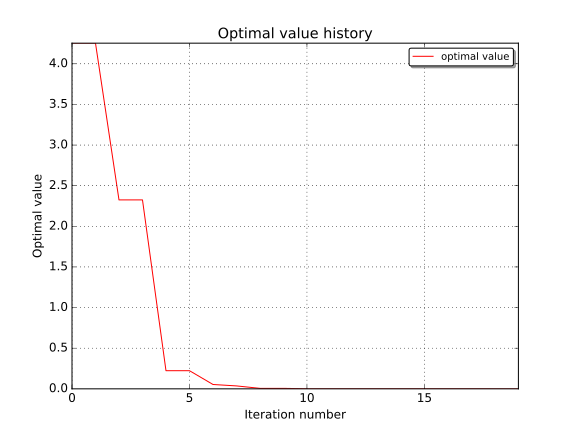

EGO algorithm usage examples
============================

.. code:: python

    from __future__ import print_function
    import openturns as ot
    import math as m
    import openturns.testing
    
    #ot.Log.Show(ot.Log.INFO)
    ot.TBB.Disable()
    

The EGO algorithm [Jones1998]\_ is an adaptative optimization method
based on kriging.

An initial design of experiment is used to build a first metamodel. At
each iteration a new point that maximizes a criterion is chosen as
optimizer candidate.

The criterion uses a tradeoff between the metamodel value and the
conditional variance.

Then the new point is evaluated using the original model and the
metamodel is relearnt on the extended design of experiment.

E.I. formulation: Ackley test-case
----------------------------------

.. math:: f(x) = -a \exp\left(-b\sqrt{\frac{1}{d}\sum_{i=1}^d}x_i^2\right)-\exp(\left(\frac{1}{d}\sum_{i=1}^d cos(c x_i)\right)+a+\exp(1)

.. math:: dimension = d, x \in [-15,15^d], a=20, b=0.2, c=2\pi, \hat{x}=(0,0,...,0), f_{min} = 0

.. code:: python

    # ackley 2-d
    ot.RandomGenerator.SetSeed(0)
    dim = 2
    
    
    # model
    def ackley(X):
        a = 20.0
        b = 0.2
        c = 2.0 * m.pi
        d = len(X)
        f = -a * m.exp(-b*m.sqrt(sum(x**2 for x in X)/d)) - m.exp(sum(m.cos(c*x) for x in X)/d) + a + m.exp(1.0)
        #print(X, f)
        return [f]
    
    model = ot.PythonFunction(dim, 1, ackley)
    
    # problem
    problem = ot.OptimizationProblem()
    problem.setObjective(model)
    bounds = ot.Interval([-15.0] * dim, [15.0] * dim)
    problem.setBounds(bounds)
    
    # design
    center = [0.5] * dim
    levels = [2.0, 4.0, 8.0, 14.0]
    experiment = ot.Factorial(center, levels)
    inputSample = experiment.generate()
    outputSample = model(inputSample)
    
    # first kriging model
    covarianceModel = ot.SquaredExponential([2.50057] * dim, [0.1])
    basis = ot.ConstantBasisFactory(dim).build()
    kriging = ot.KrigingAlgorithm(inputSample, outputSample, basis, covarianceModel)
    kriging.run()
    
    # algo
    algo = ot.EfficientGlobalOptimization(problem, kriging.getResult())
    #solver = ot.NLopt('GN_ESCH')
    ##solver = ot.NLopt('GN_MLSL')
    algo.setMaximumIterationNumber(15)
    algo.setMaximumAbsoluteError(1e-10)
    algo.setMaximumRelativeError(1e-10)
    algo.setMaximumResidualError(1e-10)
    algo.setMaximumConstraintError(1e-10)
    algo.setMultiStartExperimentSize(100) # size of design in which to draw starting points
    algo.setMultiStartNumber(20) # number of multistart points for improvement optim
    algo.setParameterEstimationPeriod(1) # relearn kriging parameters every X iteration
    algo.setImprovementFactor(1.0) # improvement stopping criterion factor
    algo.setCorrelationLengthFactor(1.0) # correlation length stopping criterion factor
    algo.run()
    result = algo.getResult()
    
    #print('1st pass result=', result)
    print('iteration=', result.getIterationNumber())
    #print(result.getInputSample())
    #print(result.getOutputSample())
    
    # local refinement
    algo2 = ot.NLopt(problem, 'LD_LBFGS')
    algo2.setStartingPoint(result.getOptimalPoint())
    algo2.run()
    result = algo2.getResult()
    
    
    result.drawOptimalValueHistory()

.. parsed-literal::

    iteration= 7

AIE formulation: Branin test-case
---------------------------------

.. math::  g(u_1, u_2) = \frac{(u_2-5.1\frac{u_1^2}{4\pi^2}+5\frac{u_1}{\pi}-6)^2+10(1-\frac{1}{8 \pi}) \times cos(u_1)+10-54.8104}{51.9496}

.. math::  t(x_1, x2) = 15 x_1 - 5, 15 x_2 

.. math:: f(x_1, x_2) = g \circ  t(x_1, x_2)

.. math:: dimension = 2, x \in [0, 1]^2, \hat{x}=(0.123895, 0.818329),(0.542773, 0.151666),(0.961652, 0.165000), f_{min} = -1.04741

This time the AEI formulation is used, the objective output should be
2-d with the noise variance.

Here we assume a constant noise variance:

.. math:: \sigma_{\epsilon} = 0.96

.. code:: python

    # branin
    
    dim = 2
    
    # model
    branin = ot.Function(['x1', 'x2'], ['f', 'sigma2'], ['((x2-(5.1/(4*_pi^2))*x1^2+5*x1/_pi-6)^2+10*(1-1/8*_pi)*cos(x1)+10-54.8104)/51.9496', '0.96'])
    transfo = ot.Function(['u1', 'u2'], ['x1', 'x2'], ['15*u1-5', '15*u2'])
    model = ot.ComposedFunction(branin, transfo)
    
    # problem
    problem = ot.OptimizationProblem()
    problem.setObjective(model)
    bounds = ot.Interval([0.0] * dim, [1.0] * dim)
    problem.setBounds(bounds)
    
    # design
    experiment = ot.Box([1, 1])
    inputSample = experiment.generate()
    modelEval = model(inputSample)
    outputSample = modelEval.getMarginal(0)
    
    
    # first kriging model
    covarianceModel = ot.SquaredExponential([0.3007, 0.2483], [0.981959])
    basis = ot.ConstantBasisFactory(dim).build()
    kriging = ot.KrigingAlgorithm(inputSample, outputSample, basis, covarianceModel)
    noise = list(map(lambda x: x[1], modelEval))
    kriging.setNoise(noise)
    kriging.run()
    
    # algo
    algo = ot.EfficientGlobalOptimization(problem, kriging.getResult())
    algo.setNoiseModel(ot.Function(['x1', 'x2'], ['sigma2'], ['0.96'])) # assume constant noise var
    algo.setMaximumIterationNumber(20)
    algo.setImprovementFactor(0.05) # stop whe improvement is < a% the current optimum
    algo.setAIETradeoff(0.66744898)
    algo.run()
    result = algo.getResult()
    #print('1st pass result=', result)
    print('iteration=', result.getIterationNumber())
    #print(result.getInputSample())
    #print(result.getOutputSample())

.. parsed-literal::

    iteration= 7

