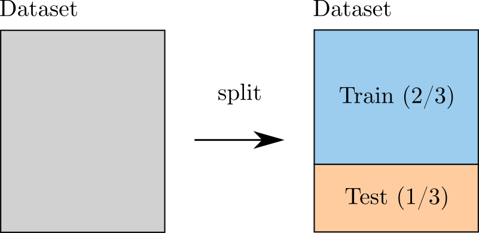
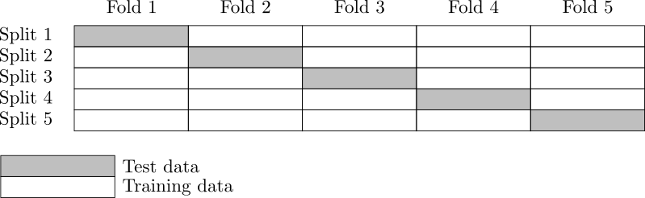

.. _cross_validation:

Validation and cross validation of surrogate models
---------------------------------------------------

Introduction
~~~~~~~~~~~~

In ordinary validation of a surrogate model, we hold some observations from the
sample and train the model on the remaining observations.
Then we test the surrogate model against the hold out observations.
One of the problems of this method is that the surrogate
model is trained using only a subset of the available data.
As a consequence, the estimated error can be pessimistic.
In cross-validation, the roles of the train and test samples are exchanged.
Hence, more of the available data is used, resulting in an improved
accuracy of the estimated error of the metamodel.
One of the problems of cross-validation is that we have to train
the surrogate model several times which can be time consuming.
In this case, the fast methods that we present below can be useful.

Let :math:`\model: \set{X} \rightarrow \Rset` be a physical
model where :math:`\set{X} \subseteq \Rset^{n_x}`
is the domain of the input parameters :math:`\vect{x}`.
Let :math:`\metaModel` be a surrogate model of :math:`\model`, i.e.
an approximation of the function.
Once the metamodel :math:`\metaModel`
of the original numerical model :math:`\model` has been
built up, we may estimate the mean squared error, i.e. the
discrepancy between the response surface and the true model response
in terms of the weighted :math:`L^2`-norm:

.. math::
   \operatorname{MSE} \left(\metaModel\right)
   & = \left\| \model(\vect{x}) - \metaModel(\vect{x}) \right\|_{L^2}^2(\set{X}) \\
   & = \int_{\set{X}} \left[ \model(\vect{x}) - \metaModel(\vect{x}) \right]^2  \pdf d\vect{x}

where :math:`\inputProbabilityDensityFunction` is the probability density function
of the random vector :math:`\vect{X}`.
In this section, we present the cross-validation of linear least squares
models, as presented in [wang2012]_ page 485.

The fraction of variance unexplained (FVU) is:

.. math::

    \operatorname{FVU}
    = \frac{\operatorname{MSE}\left(\metaModel\right)}{\Var{Y}}

where :math:`\Var{Y}` is the variance of the random output :math:`Y = \model(\vect{X})`.
The fraction of variance unexplained is a relative mean squared error.
The coefficient of determination is:

.. math::

    R^2 & = 1 - \operatorname{FVU} \\
    & = 1 - \frac{\operatorname{MSE}\left(\metaModel\right)}{\Var{Y}}

Simple validation
~~~~~~~~~~~~~~~~~

In the ordinary or naive validation method, we divide the data sample (i.e.
the experimental design) into two independent sub-samples:
the training and the test set.
In this case, the metamodel :math:`\metaModel`
is built from one sub-sample, i.e. the *training set*, and its
performance is assessed by comparing its predictions to the other
subset, i.e. the *test set*.
A single split will lead to a validation estimate.
When several splits are created, the cross-validation error
estimate is obtained by averaging over the splits.
When the coefficient of determination is evaluated on a test set which is
independent from the training set, the coefficient of determination is
called the :math:`Q^2` score.

    *Figure 1.* Validation using one single split.

Let :math:`n \in \Nset` be an integer representing the sample size.
Let :math:`\set{D} \subseteq \set{X}` be a set of :math:`n` independent
observations of the random vector :math:`\vect{X}`:

.. math::
    \set{D} = \left\{\vect{x}^{(1)}, ..., \vect{x}^{(n)} \in \Rset^{n_x}\right\}

and consider the corresponding outputs of the model:

.. math::
    \left\{y^{(1)}, ..., y^{(n)}  \in \Rset\right\}

where:

.. math::
    y^{(j)} = \model\left(\vect{x}^{(j)}\right)

for :math:`j = 1, ..., n`.
The Monte-Carlo estimator of the mean squared error is:

.. math::
    \widehat{\operatorname{MSE}}\left(\metaModel\right)
    = \frac{1}{n} \sum_{j = 1}^n \left( y^{(j)} - \metaModel \left(\vect{x}^{(j)}\right) \right)^2

The previous equation can be equivalently expressed depending on
the model since :math:`y^{(j)} = \model\left(\vect{x}^{(j)}\right)`.
It seems, however, more consistent to use :math:`y^{(j)}` because the
true model :math:`g` is unknown (otherwise we would not use a
surrogate).

The sample relative mean squared error is:

  .. math::

      \widehat{\varepsilon}_{MSE}\left(\metaModel\right)
      = \frac{\widehat{\operatorname{MSE}}\left(\metaModel\right)}{\widehat{\sigma}^2(Y)}

where :math:`\widehat{\sigma}^2(Y)` is the sample variance of the random output:

.. math::

      \widehat{\sigma}^2(Y)
      = \frac{1}{n - 1} \sum_{j = 1}^n \left( y^{(j)} -   \bar{y} \right)^2

where :math:`\bar{y}` is the sample mean of the output:

.. math::

    \bar{y} = \frac{1}{n} \sum_{j = 1}^n y^{(j)}.

If the test set :math:`\set{D}` is not independent from the training set
(the set used to calibrate the metamodel), then the previous estimator
may underestimate the true value of the mean squared error.
In order to create a test set independent from the training set, a
simple method is to split the data set into two parts.
The drawback of this method is that this reduces the size of the training
set, so that the mean squared error evaluated on the test set can be pessimistic.
The leave-one-out (LOO) and K-Fold cross validation methods presented in the next sections
use all the data available.

Naive and fast cross-validation
~~~~~~~~~~~~~~~~~~~~~~~~~~~~~~~

As seen in the previous section, the simplest method splits the data
into a training set and a test set.
Moreover, provided these two sets are independent, then the estimate
of the error is unbiased.
In order to use all the available data instead of a subset of it,
two other estimators have been set up:
the leave-one-out and K-Fold estimators, which are the topic of the next
sections.

When implemented naively, these methods may require to build many surrogate models,
which can be time-consuming.
Fortunately, there are *shortcuts* for many surrogate models
including linear least squares and splines (and others).
For a linear least squares model, some methods use the
Sherman-Morrisson-Woodbury formula to get updates of the inverse Gram matrix,
as we are going to see later in this document.
This makes it possible to easily evaluate metamodel errors
of a linear least squares model.

Leave-one-out cross-validation
~~~~~~~~~~~~~~~~~~~~~~~~~~~~~~

In this section, we present the naive leave-one-out error estimator,
also known as jackknife in statistics.
Let :math:`\metaModel^{(-j)}` be the surrogate model estimated from the
leave-one-out experimental design :math:`\set{D} \setminus \{\vect{x}^{(j)}\}`.
This is the experimental design where the :math:`j`-th observation
:math:`\vect{x}^{(j)}` is set aside.
The corresponding set of observation indices is:

.. math::
    \set{S}_{-j} = \{1, ..., j - 1, j + 1, ..., n\},

the corresponding input observations are:

.. math::
    \set{D} \setminus \{\vect{x}^{(j)}\}
    = \left\{\vect{x}^{(1)}, ..., \vect{x}^{(j - 1)},
    \vect{x}^{(j + 1)}, ..., \vect{x}^{(n)}\right\}
    = \left\{\vect{x}^{(j)}, \; j \in \set{S}_{-j}\right\}

and the corresponding output observations are:

.. math::
    \left\{y^{(1)}, ..., y^{(j - 1)}, y^{(j + 1)}, ..., y^{(n)}\right\}.

The leave-one-out residual is defined as the difference between the model evaluation at
:math:`\vect{x}^{(j)}` and its leave-one-out prediction (see [blatman2009]_
eq. 4.26 page 85):

.. math::

    \Delta^{(j)}
    = y^{(j)} - \metaModel^{(-j)}\left(\vect{x}^{(j)}\right)

We repeat this process for all observations in the experimental
design and obtain the predicted residuals
:math:`\Delta^{(j)}` for :math:`j = 1, \dots, n`.
Finally, the LOO mean squared error estimator is:

.. math::

    \widehat{\operatorname{MSE}}_{LOO}
    & =  \frac{1}{n} \sum_{j = 1}^n \left( \Delta^{(j)} \right)^2

One of the drawbacks of the naive method is that it may require
to estimate :math:`n` different surrogate models.
If :math:`n` is large or if training each surrogate model is costly,
then the leave-one-out method can be impractical.
If, however, the surrogate model is based on the linear least squares method,
then the leave-one-out error may be computed much more efficiently, as
shown in the next section.

Fast leave-one-out cross-validation of a linear model
~~~~~~~~~~~~~~~~~~~~~~~~~~~~~~~~~~~~~~~~~~~~~~~~~~~~~

In this section, we present the fast leave-one-out error estimator
of a linear least squares model.
In the special case of a linear least squares model, [stone1974]_ (see eq. 3.13 page 121)
showed that the leave-one-out residuals have an expression which depends on the diagonal
of the projection matrix.
In this case, the evaluation of the leave-one-out mean squared error involves the
multiplication of the raw residuals by a correction which involves the leverages
of the model.
This method makes it possible to directly evaluate the mean squared error without
necessarily estimating the coefficients of :math:`n` different leave-one-out
least squares models.
It is then much faster than the naive leave-one-out method.

Assume that the model is linear:

.. math::

    \model(\vect{x}) = a_0 + \sum_{i=1}^{n_x} a_i x_i

for any :math:`\vect{x} \in \set{X}` where :math:`\vect{a} \in \Rset^{n_x + 1}`
is the vector of parameters.
Let :math:`\vect{y} \in \Rset^n` be the vector of output observations:

.. math::
    \vect{y} = \left(y^{(1)}, ..., y^{(n)} \right)^T.

The goal of the least squares method is to estimate the coefficients
:math:`\vect{a}` using the vector of observations :math:`\vect{y}`.
The output vector from the linear model is:

.. math::

    \vect{y} =  \boldsymbol{D} \vect{a}

for any :math:`\vect{x} \in \set{X}` where
:math:`\boldsymbol{D} \in \Rset^{n \times (n_x + 1)}` is the
design matrix.
For a linear model, the columns of the design matrix correspond
to the input parameters and the rows correspond to the observations:

.. math::
    \boldsymbol{D}
    =
    \begin{pmatrix}
    1      & x_1^{(1)} & \ldots  & x_{n_x}^{(1)} \\
    \vdots &           &         & \vdots \\
    1      & x_1^{(n)} & \ldots  & x_{n_x}^{(n)}
    \end{pmatrix}.

In the previous equation, notice that the design matrix depends on the
experimental design :math:`\set{D}`.

Assume that the matrix :math:`\boldsymbol{D}` has full rank.
The solution of the linear least squares problem is
given by the normal equations (see [Bjorck1996]_ eq. 1.1.15 page 6):

.. math::

    \widehat{\vect{a}} = \left(\boldsymbol{D}^T \boldsymbol{D} \right)^{-1} \boldsymbol{D}^T \vect{y}.

The linear surrogate model is the linear model with estimated coefficients:

.. math::

    \metaModel(\vect{x}) = \hat{a}_0 + \sum_{i=1}^{n_x} \hat{a}_i x_i.

The vector of predictions from the surrogate model is:

.. math::

    \widehat{\vect{y}} = \boldsymbol{D} \widehat{\vect{a}}

for any :math:`\vect{x} \in \set{X}` where :math:`\widehat{\vect{a}}` is the
estimate from linear least squares.
We substitute the estimator in the previous equation and
get the value of the surrogate linear model:

.. math::

    \widehat{\vect{y}}
    = \boldsymbol{D} \left(\boldsymbol{D}^T \boldsymbol{D} \right)^{-1} \boldsymbol{D}^T \vect{y}

Let :math:`\boldsymbol{H} \in \Rset^{n \times n}` be the projection ("hat") matrix (see [wang2012]_ eq. 16.8 page 472):

.. math::

    \boldsymbol{H}
    = \boldsymbol{D} \left(\boldsymbol{D}^T \boldsymbol{D} \right)^{-1} \boldsymbol{D}^T.

Hence, the value of the linear model is the matrix-vector product:

.. math::

    \widehat{\vect{y}} = \boldsymbol{H} \vect{y}.

We can prove that the LOO residual is:

.. math::
    :label: predictionCorrection

    y^{(j)} - \widehat{g}^{(-j)}\left(\vect{x}^{(j)}\right)
    = \frac{y^{(j)} - \widehat{g}\left(\vect{x}^{(j)}\right)}{1 - h_{jj}}

where :math:`h_{jj}` is the :math:`j`-th diagonal term of the hat matrix.
In other words, the residual of the LOO surrogate model is equal to the
residual of the full surrogate model corrected by :math:`1 - h_{jj}`.

The number :math:`h_{jj}` is the *leverage* of the :math:`j`-th
observation.
It can be proved (see [sen1990]_ page 157) that:

.. math::
    \frac{1}{n} \leq h_{jj} \leq 1.

Moreover (see [sen1990]_ eq. 5.10 page 106):

.. math::
    \sum_{j = 1}^{n} h_{jj}  = \operatorname{Tr}(H) = n_x + 1

where :math:`\operatorname{Tr}(H)` is the trace of the hat matrix.
The leverage describes how far away the individual data point is from the centroid
of all data points (see [sen1990]_ page 155).
The equation :eq:`predictionCorrection` implies that if :math:`h_{jj}` is
large (i.e. close to 1), then removing the :math:`j`-th observation
from the training sample changes the residual of the leave-one-out
surrogate model significantly.

Using the equation :eq:`predictionCorrection` avoids to actually build the LOO surrogate.
We substitute the previous expression in the definition of the leave-one-out
mean squared error estimator and get the fast leave-one-out cross validation
error ([wang2012]_ eq. 16.25 page 487):

.. math::
    \widehat{\operatorname{MSE}}_{LOO}
    = \frac{1}{n} \sum_ {j = 1}^n \left( \frac{y^{(j)} -
          \widehat{g}\left(\vect{x}^{(j)}\right)}{1 - h_{jj}} \right)^2

Corrected leave-one-out
~~~~~~~~~~~~~~~~~~~~~~~

A penalized variant of the leave-one-out mean squared error may be used in order to
increase its robustness with respect to overfitting.
This is done using a criterion which takes into account the
number of coefficients compared to the size of the
experimental design.
The corrected leave-one-out error is ([chapelle2002]_, [blatman2009]_ eq. 4.38 page 86):

.. math::
    \widehat{\operatorname{MSE}}_{LOO}^{*}
    = \widehat{\operatorname{MSE}}_{LOO} T(n_x, n)

where the penalty factor is:

.. math::
    T(n_x, n)
    = \frac{n}{n - (n_x + 1)}  \left(1 + \frac{\operatorname{Tr} \left( \boldsymbol{C}_{emp}^{-1}  \right) }{n} \right)

where :math:`\boldsymbol{C}_{emp}` is the matrix:

.. math::

    \boldsymbol{C}_{emp} = \frac{1}{n}\boldsymbol{D}^{\textsf{T}}\boldsymbol{D}

and :math:`\operatorname{Tr}` is the trace operator.

K-fold cross-validation
~~~~~~~~~~~~~~~~~~~~~~~

In this section, we present the naive K-Fold cross-validation.
Let :math:`k \in \Nset` be a parameter representing the number of
splits in the data set.
The :math:`k`-fold cross-validation technique relies on splitting the
data set :math:`\set{D}` into :math:`k` sub-samples
:math:`\set{D}_1, \dots, \set{D}_k`, called the *folds*.
The corresponding set of indices:

.. math::

    \set{S}_1 \; \cup \; \cdots \; \cup \; \set{S}_k
    = \{1, ..., n\}

and the corresponding set of input observations is:

.. math::

    \set{D} = \set{D}_1 \; \cup \; \cdots \; \cup \; \set{D}_k.

The next figure presents this type of cross validation.

    *Figure 2.* K-Fold cross-validation.

The :math:`k` folds are generally chosen to be of
approximately equal sizes.
If the sample size :math:`n` is a multiple of :math:`k`, then the
folds can have exactly the same size.

For any :math:`\ell \in \{1, ..., k\}`, let :math:`\metaModel^{(-\set{D}_{\ell})}`
be the surrogate model estimated on the K-fold sample
:math:`\set{D} \setminus \set{D}_{\ell}`.
Let :math:`\Delta^{(\ell, j)}` be defined as the K-Fold residual:

.. math::

    \Delta^{(\ell, j)}
    = y^{(j)} - \widehat{g}^{(-\set{D}_{\ell})} \left(\vect{x}^{(j)}\right)

for :math:`\ell = 1, ..., k` and :math:`j \in \set{S}_{\ell}`.
In the previous equation, the *predicted residual*
:math:`y^{(j)} - \metaModel^{(-\set{D}_{\ell})} \left(\vect{x}^{(j)}\right)`
is the difference between the
evaluation of :math:`\model` and the value of the K-Fold surrogate
:math:`\metaModel^{(-\set{D}_{\ell})}` at the point :math:`\vect{x}^{(j)}`.
The local approximation error is estimated on the sample :math:`\set{D}_{\ell}`:

.. math::
   \widehat{\operatorname{MSE}}^{(\ell)}
   = \frac{1}{n_\ell}  \sum_{j \in \set{S}_\ell} \left( \Delta^{(\ell, j)} \right)^2

where :math:`n_\ell` is the number of observations in
the sub-sample :math:`\set{D}_{\ell}`:

.. math::

    n_{\ell} = \operatorname{card}\left(\set{D}_{\ell} \right).

For any :math:`\ell \in \{ 1, \dots, k\}`, the K-Fold mean square error :math:`\widehat{\operatorname{MSE}}^{(\ell)}` is estimated using
the training set :math:`\set{D} \setminus \set{D}_{\ell}` and
the test set :math:`\set{D}_{\ell}`.
Finally, the global K-fold cross-validation error estimate is the
sample mean ([burman1989]_ page 505):

.. math::
  :label: kfoldMean

   \widehat{\operatorname{MSE}}_{KFold}
   = \sum_{\ell = 1}^{k} \frac{n_{\ell}}{n} \widehat{\operatorname{MSE}}^{(\ell)}

The weight :math:`n_{\ell} / n` reflects the fact that a fold containing
more observations weighs more in the estimator.
The K-Fold error estimate can be obtained
with a single split of the data :math:`\set{D}` into :math:`k` folds.
The *leave-one-out* (LOO) cross-validation is a special case of
the K-Fold cross-validation where the number of folds :math:`k` is
equal to :math:`n`, the sample size of the experimental design
:math:`\set{D}`.

We substitute the previous equation in the definition of the K-Fold MSE and get:

.. math::

    \widehat{\operatorname{MSE}}_{KFold}
    & = \sum_{\ell = 1}^k \frac{n_{\ell}}{n} \frac{1}{n_{\ell}} \sum_{j \in \set{S}_{\ell}}
    \left(\Delta^{(\ell, j)}\right)^2.

This implies:

.. math::

    \widehat{\operatorname{MSE}}_{KFold}
    & = \frac{1}{n} \sum_{\ell = 1}^k \sum_{j \in \set{S}_{\ell}}
    \left(\Delta^{(\ell, j)}\right)^2.

The previous equation states that the K-Fold mean squared error is the
sample mean of the corrected K-Fold squared residuals.

Assume that the number of folds divides the sample size.
Mathematically, this means that :math:`k` divides :math:`n`.
In this special case, each fold has the same number of observations:

.. math::

    n_\ell = \frac{n}{k}

for :math:`\ell = 1, ..., k`. Hence all local K-Fold MSE have the
same weight and we have :math:`\frac{n_\ell}{n} = \frac{1}{k}`
for :math:`\ell = 1, ..., k`.
This implies that the K-Fold mean squared error has a  particularly simple expression
([deisenroth2020]_ eq. 8.13 page 264):

.. math::
  :label: kfoldMeanEqual

   \widehat{\operatorname{MSE}}_{KFold}
   = \frac{1}{k} \sum_{\ell = 1}^{k} \widehat{\operatorname{MSE}}^{(\ell)}.

Fast K-Fold cross-validation of a linear model
~~~~~~~~~~~~~~~~~~~~~~~~~~~~~~~~~~~~~~~~~~~~~~

In this section, we present a fast version of the K-Fold cross-validation
that can be used for a linear model.
While evaluating the mean squared error with the fast LOO formula involves the division by :math:`1 - h_{jj}`,
using the fast K-Fold method involves the resolution of a linear system of equations.
The equations introduced by [shao1993]_ are presented in [suzuki2020]_ (proposition 14 page 71).

For any :math:`\ell \in \{1, ..., k\}`, let :math:`\boldsymbol{D}_{\ell} \in \Rset^{n_\ell \times m}`
be the rows of the design matrix :math:`\boldsymbol{D}` corresponding to the indices of the observations
involved in the :math:`\ell`-th fold:

.. math::

    \boldsymbol{D}_{\ell}
    =\begin{pmatrix}
    d_{j_1, 1} & \ldots & d_{j_1, m} \\
    \vdots & & \vdots \\
    d_{j_{n_\ell}, 1} & \ldots & d_{j_{n_\ell}, m}
    \end{pmatrix}

where :math:`j_1, ..., j_{n_\ell} \in \set{S}_{\ell}` are the
indices of the observations involved in the :math:`\ell`-th fold.
For any :math:`\ell \in \{1, ..., k\}`,
let :math:`\boldsymbol{H}_{\ell} \in \Rset^{n_{\ell} \times n_{\ell}}` be the sub-matrix of
the hat matrix corresponding to the indices of the observations in the
:math:`\ell`-th fold:

.. math::

    \boldsymbol{H}_{\ell}
    = \boldsymbol{D}_{\ell} \left(\boldsymbol{D}^T \boldsymbol{D} \right)^{-1} \boldsymbol{D}_{\ell}^T

It is not necessary to evaluate the previous expression in order to evaluate
the corresponding hat matrix.
Indeed, the matrix :math:`\boldsymbol{H}_{\ell}` can be computed by extracting the corresponding
rows and columns from the full hat matrix :math:`\boldsymbol{H}`:

.. math::

    \boldsymbol{H}_{\ell}
    =
    \begin{pmatrix}
    h_{j_1, j_1} & \ldots & h_{j_1, j_{n_\ell}} \\
    \vdots & & \vdots \\
    h_{j_{n_\ell}, j_1} & \ldots & h_{j_{n_\ell}, j_{n_\ell}}
    \end{pmatrix}.

Let :math:`\widehat{\boldsymbol{r}}_{\ell} \in \mathbb{R}^{n_{\ell}}` be the vector of
corrected K-Fold residuals:

.. math::

    (\boldsymbol{I}_{\ell} - \boldsymbol{H}_{\ell}) \widehat{\boldsymbol{r}}_{\ell}
    = \boldsymbol{y}_{\ell} - \widehat{\boldsymbol{y}}_{\ell}

where :math:`\boldsymbol{I}_{n_{\ell}} \in \Rset^{n_{\ell} \times n_{\ell}}` is the identity matrix,
:math:`\boldsymbol{y}_{\ell} \in \Rset^{n_{\ell}}` is the vector of output observations in the
:math:`\ell`-th fold:

.. math::

    \boldsymbol{y}_{\ell}
    = \left(y^{(j)}\right)^T_{j \in \set{S}_{\ell}}

and :math:`\widehat{\boldsymbol{y}}_{\ell} \in \Rset^{n_{\ell}}` is the corresponding
vector of output predictions from the linear least squares surrogate model:

.. math::

    \widehat{\boldsymbol{y}}_{\ell}
    = \left(g\left(\vect{x}^{(j)}\right)\right)^T_{j \in \set{S}_{\ell}}.

Then the mean squared error of the :math:`\ell`-th fold is:

.. math::

    \widehat{\operatorname{MSE}}^{(\ell)}
    = \frac{1}{n_{\ell}} \sum_{j \in \set{S}_{\ell}}
    \left(\widehat{\boldsymbol{r}}_{\ell}\right)_j^2.

Then the K-Fold mean squared error is evaluated from equation :eq:`kfoldMean`.

Cross-validation and model selection
~~~~~~~~~~~~~~~~~~~~~~~~~~~~~~~~~~~~

If a model selection method is used (such as :class:`~openturns.LARS`), then the fast cross-validation (CV)
method can produce an optimistic estimated error i.e. the true error can
be greater that the estimated error (see [hastie2009]_ section 7.10.2 page 245).
This is because the fast CV does not take model selection into account.

The reason for this behavior is that the model selection produces a set
of predictors which fits the data particularly well.
If a model selection method is involved, only the simple validation
method can produce an unbiased estimator, because the model selection
is then involved each time a new surrogate model is trained i.e. each
time its coefficients are estimated.
The fast method, on the other hand, only considers the basis which is the
result of a single training step.

Notice, however, that the order of magnitude of the error estimated
using the fast method with a surrogate model involving a model selection may be satisfactory
in some cases.

Conclusion
~~~~~~~~~~

The generic cross-validation method can be implemented using the following classes:

- :class:`~openturns.MetaModelValidation`: uses a test set to
  compute the mean squared error ;
- :class:`~openturns.LeaveOneOutSplitter`: uses the leave-one-out method
  to split the data set ;
- :class:`~openturns.KFoldSplitter`: uses the K-Fold method
  to split the data set.

See :ref:`pce_cross_validation` for specific methods for the the cross-validation
of a polynomial chaos expansion.

.. topic:: API:

    - See :class:`~openturns.MetaModelValidation`
    - See :class:`~openturns.KFoldSplitter`
    - See :class:`~openturns.LeaveOneOutSplitter`

.. topic:: References:

    - [blatman2009]_
    - [chapelle2002]_
    - [deisenroth2020]_
    - [hastie2009]_
    - [sen1990]_
    - [shao1993]_
    - [stone1974]_
    - [suzuki2020]_
    - [wang2012]_

