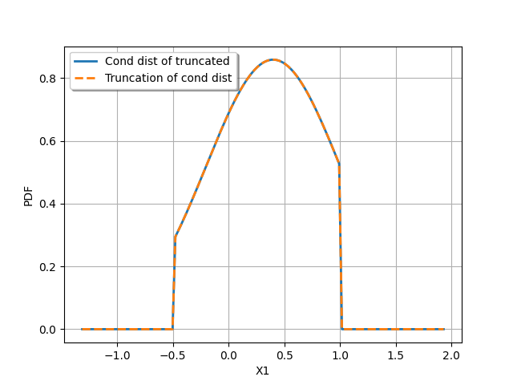

.. _conditional_distributions:

Conditional distributions
-------------------------

The library offers some modelisation capacities on conditional distributions:

- Case 1: Create a joint distribution using conditioning,
- Case 2: Condition a joint distribution by some values of its marginals,
- Case 3: Create a distribution whose parameters are random,
- Case 4: Create a Bayesian posterior distribution.

Case 1: Create a joint distribution using conditioning
~~~~~~~~~~~~~~~~~~~~~~~~~~~~~~~~~~~~~~~~~~~~~~~~~~~~~~

The objective is to create the joint distribution of the random vector :math:`(\vect{Y},\inputRV)`
where :math:`\vect{Y}` follows the distribution :math:`\mathcal{L}_{\vect{Y}}`
and :math:`\inputRV|\vect{\Theta}` follows the distribution :math:`\mathcal{L}_{\inputRV|\vect{\Theta}}`
where :math:`\vect{\Theta}=g(\vect{Y})` with :math:`g` a link function of input dimension
the dimension of :math:`\mathcal{L}_{\vect{Y}}` and output dimension the dimension of :math:`\vect{\Theta}`.

This distribution is limited to the continuous case, ie when both the conditioning and the conditioned distributions are continuous.
Its probability density function is defined as:

.. math::

    f_{(\vect{Y},\inputRV)}(\vect{y}, \vect{x}) = f_{\inputRV|\vect{\theta}=g(\vect{y})}(\vect{x}|g(\vect{y})) f_{\vect{Y}}( \vect{y})

with :math:`f_{\inputRV|\vect{\theta} = g(\vect{y})}` the PDF of the distribution of :math:`\inputRV|\vect{\Theta}`
where :math:`\vect{\Theta}` has been replaced by :math:`g(\vect{y})`,
:math:`f_{\vect{Y}}` the PDF of :math:`\vect{Y}`.

See the class :class:`~openturns.JointByConditioningDistribution`.

Case 2: Condition a joint distribution to some values of its marginals
~~~~~~~~~~~~~~~~~~~~~~~~~~~~~~~~~~~~~~~~~~~~~~~~~~~~~~~~~~~~~~~~~~~~~~

Let :math:`\inputRV` be a random vector of dimension :math:`\inputDim`. Let :math:`\cI \subset \{1, \dots, \inputDim \}`
be a set of indices of components of  :math:`\inputRV`, :math:`\overline{\cI}` its complementary in
:math:`\{1, \dots, \inputDim \}` and :math:`\vect{x}_\cI` a real vector of dimension equal to the cardinal of :math:`\cI`.
The objective is to create the distribution of:

.. math::

    \inputRV_{\overline{\cI}}|\inputRV_\cI = \vect{x}_\cI

See the class :class:`~openturns.experimental.PointConditionalDistribution`.

This class requires the following features:

- each component :math:`X_i` is continuous or discrete: e.g., it can not be a :class:`~openturns.Mixture` of
  discrete and continuous distributions,
- the copula of :math:`\inputRV` is continuous: e.g., it can not be the :class:`~openturns.MinCopula`,
- the random vector :math:`\inputRV_{\overline{\cI}}` is continuous or discrete: all its components must be discrete
  or all its components must be continuous,
- the random vector :math:`\inputRV_{\cI}` may have some discrete components and some continuous components.

Then, the pdf (probability density function if :math:`\inputRV_{\overline{\cI}}` is continuous or probability distribution function if
:math:`\inputRV_{\overline{\cI}}` is discrete) of :math:`\inputRV_{\overline{\cI}}|\inputRV_\cI = \vect{x}_\cI` is defined by (in the following
expression, we assumed a particular order of the conditioned components among the whole set of components for easy reading):

.. math::
    :label: condPDF2

    p_{\inputRV_{\overline{\cI}}|\inputRV_\cI = \vect{x}_\cI}(x_{\overline{\cI}})  = \dfrac{p_{\inputRV}(\vect{x
    }_{\overline{\cI}}, \vect{x}_{\cI})}{p_{\inputRV_{\cI}}(\vect{x}_{\cI})}

where:

.. math::

    p_{\inputRV}(\vect{x})  = \left( \prod_{i=1}^\inputDim p_i(x_i)\right) c(F_1(x_1), \dots,
    F_\inputDim(x_\inputDim))

with:

- :math:`c` is the probability density copula of :math:`\inputRV`,
- if :math:`X_i` is a continuous component, :math:`p_i` is its probability density function,
- if :math:`X_i` is a discrete component, :math:`p_i = \sum_{x^i_k \in \cS^i} \Prob{X_i = x^i_k} \delta_{x^i_k}` where
  :math:`\cS^i = \{ x^i_k \}` is its support and :math:`\delta_{x^i_k}` the Dirac distribution centered on
  :math:`x^i_k`.

Then, if :math:`\inputRV_{\overline{\cI}}` is continuous, we have:

.. math::

    p_{\inputRV_{\cI}}(\vect{x}_{\cI})  = \int p_{\inputRV}(\vect{x}_{\overline{\cI}}, \vect{x}_{\cI}) \,
    \di{\vect{x}_{\overline{\cI}}}

and if :math:`\inputRV_{\overline{\cI}}` is discrete with its support denoted by
:math:`\cS(\vect{X}_{\overline{\cI}}) = \prod_{i \in \overline{\cI}} S^i`, we have:

.. math::

    p_{\inputRV_{\cI}}(\vect{x}_{\cI})  & = \sum_{\vect{x}_{\overline{\cI}} \in \cS(\inputRV_{\overline{\cI}})}
    p_{\inputRV}(\vect{x}_{\overline{\cI}}, \vect{x}_{\cI})

Simplification mechanisms to compute :eq:`condPDF2` are implemented for some distributions. We detail some cases where a simplification has
been implemented.

**Elliptical distributions:** This is the case for normal and Student distributions. If :math:`\inputRV` follows a normal or a Student distribution,
then :math:`\inputRV_{\overline{\cI}}` respectively follows a normal or a Student distribution with modified parameters.
See `Conditional Normal <https://en.wikipedia.org/wiki/Multivariate_normal_distribution>`_ and
`Conditional Student <https://en.wikipedia.org/wiki/Multivariate_t-distribution>`_  for the formulas of the conditional distributions.

**Mixture distributions** Let :math:`\inputRV` be a random vector of dimension :math:`\inputDim` which distribution is  defined by a
:class:`~openturns.Mixture` of :math:`N` discrete or continuous atoms. Let denote by :math:`(p_1, \dots, p_N)` the PDF (Probability Density
Function for continuous atoms and Probability Distribution Function for discrete one) of each atom, with respective weights :math:`(w_1, \dots, w_N)`.
Then we get:

.. math::

    p_\inputRV(\vect{x}) = \sum_{k=1}^N w_k p_k(\vect{x})

We denote by :math:`p_{k,\cI}` the PDF of the :math:`k`-th atom conditioned by :math:`\vect{x}_{\cI}`. Then, if
:math:`p_{\inputRV_\cI}(\vect{x}_{\cI}) \neq 0`, we get:

.. math::

    p_{\inputRV|\vect{X}_\cI  = \vect{x}_\cI}(\vect{x}_{\overline{\cI}}) & = \dfrac{p_{\vect{X}}(\vect{x}_{\overline{\cI}}, \vect{x}_{\cI})}
                                {p_{\vect{X}_{\cI}}(\vect{x}_{\cI})} \\
                       & = \sum_{k=1}^N \dfrac{w_k p_{k,\cI}(\vect{x}_\cI)}{p_{\vect{X}_\cI(\vect{x}_\cI)}} \dfrac{ p_k(\vect{x}_{\overline{\cI}},
                       \vect{x}_{\cI})}{p_{k,\cI}(\vect{x}_\cI)}

which finally leads to:

.. math::
    :label: mixtureCond2

    p_{\inputRV|\vect{X}_\cI  = \vect{x}_\cI}(\vect{x}_{\overline{\cI}}) =
        \sum_{k=1}^N \alpha_k \dfrac{ p_k(\vect{x}_{\overline{\cI}}, \vect{x}_{\cI})}{p_{k,\cI}(\vect{x}_\cI)}

where :math:`\alpha_k = w_k p_{k,\cI}(\vect{x}_\cI) / c` with :math:`c = p_{\vect{X}_\cI(\vect{x}_\cI)} = \sum_{k=1}^N w_k p_{k,\cI}(\vect{x}_\cI)`.
The constant :math:`c` normalizes the weights so that :math:`\sum_k \alpha_k = 1`.

Noting that :math:`\dfrac{ p_k(\vect{x}_{\overline{\cI}}, \vect{x}_{\cI})}{p_{k,\cI}(\vect{x}_\cI)}` is the PDF of the :math:`k`-th atom
conditioned by :math:`\vect{x}_{\cI}`, we show that the random vector :math:`\inputRV|\inputRV_\cI = \vect{x}_{\cI}` is the Mixture built from the
:math:`\vect{x}_\cI`-conditioned atoms  with weights :math:`\alpha_k`.

Conclusion: The conditional distribution of a Mixture is a Mixture of conditional distributions.

**Kernel Mixture distributions:** The Kernel Mixture distribution is a particular :class:`~openturns.Mixture`: all the weights are identical and
all the kernels of the combination are of the same
discrete or continuous family. The kernels are centered on the sample points. The multivariate kernel
is a tensorized product of the same univariate kernel.

Let :math:`\inputRV` be a random vector of dimension :math:`\inputDim` defined by a  Kernel Mixture distribution based on the sample
:math:`(\vect{s}_1, \dots, \vect{s}_\sampleSize)` and the kernel :math:`K`. In the continuous case, :math:`k` is the kernel PDF and we have:

.. math::

    p_{\inputRV}(\vect{x}) = \sum_{q=1}^\sampleSize \dfrac{1}{\sampleSize} p_q(\vect{x})

where :math:`p_q` is the kernel  normalized by the bandwidth :math:`h`:

.. math::

    p_q(\vect{x}) = \prod_{j=1}^\inputDim \dfrac{1}{h^j}k\left( \dfrac{x^j- s_q^j}{h^j} \right)

Following the Mixture case, we still have the relation :eq:`mixtureCond2`. As the multivariate kernel is the tensorized product of the univariate
kernel, we get:

.. math::

    \dfrac{p_q(\vect{x}_{\overline{\cI}}, \vect{x}_{\cI})}{p_{q,\cI}(\vect{x}_\cI)} = \prod_{j \in \overline{\cI}}
    \dfrac{1}{h^j}k\left( \dfrac{x^j- s_q^j}{h^j} \right)

Conclusion: The conditional distribution of a Kernel Mixture is a Mixture which atoms are the tensorized product of the kernel on the remaining components
:math:`\vect{x}_\cI` and which weights :math:`\alpha_q` are proportional to:

.. math::

    \alpha_q \propto p_{q,\cI}(\vect{x}_\cI) = \prod_{j \in\cI} \dfrac{1}{h^j}k\left( \dfrac{x^j- s_q^j}{h^j} \right)

as we have :math:`w_k = 1/N` in :eq:`mixtureCond2`.

**Truncated distributions:**  Let :math:`\inputRV` be a random vector of dimension :math:`\inputDim` which PDF is :math:`p_\inputRV`. Let :math:`\cD`
be a domain of :math:`\Rset^\inputDim` and let :math:`\inputRV_T = \inputRV|\inputRV\in \cD` be the random vector :math:`\inputRV`
truncated to the domain :math:`\cD`. It has the following PDF:

.. math::

    p_{\inputRV_T}(\vect{x}) = \dfrac{1}{\alpha} p_{\inputRV}(\vect{x})  1_{\cD}(\vect{x})

where :math:`\alpha = \Prob{\inputRV\in \cD}`. Let  :math:`\vect{x}_\cI` be in the support of the margin :math:`\cI` of
:math:`\inputRV_T`, denoted by :math:`\inputRV_{T, \cI}`. We denote by :math:`\vect{Z}` the conditional random vector:

.. math::

    \vect{Z} = \inputRV_{T,\overline{\cI}} | \inputRV_{T, \cI} = \vect{x}_\cI

The random vector :math:`\vect{Z}` is defined on the domain:

.. math::

    \cD_{\overline{\cI}} = \{ \vect{x}_{\overline{\cI}} \, |\, (\vect{x}_{\overline{\cI}}, \vect{x}_{\cI}) \in \cD \}

The domain :math:`\cD_{\overline{\cI}} \neq \emptyset` as  :math:`\vect{x}_\cI \in \supp{\inputRV_{\cI}}`.
Then, for all :math:`\vect{x}_{\overline{\cI}}  \in \cD_{\overline{\cI}}`, we have:

.. math::

    p_{\vect{Z}}( \vect{x}_{\overline{\cI}}) & = \dfrac{p_{\inputRV_T}(\vect{x}_{\overline{\cI}}, \vect{x}_{\cI})}{p_{\inputRV_{T,\cI}}(\vect{x}_{\cI})}
    1_{\cD_{\overline{\cI}}}(\vect{x}_{\overline{\cI}}) \\
                                             &  \dfrac{1}{\alpha\, p_{\inputRV_{T,\cI}}(\vect{x}_{\cI})} p_{\inputRV}(\vect{x}
                                             _{\overline{\cI}}, \vect{x}_{\cI}))  1_{\cD}(\vect{x}_{\overline{\cI}}, \vect{x}
                                             _{\cI}) 1_{\cD_{\overline{\cI}}}(\vect{x}_{\overline{\cI}})\\
                                             &  \dfrac{1}{\alpha\, p_{\inputRV_{T,\cI}}(\vect{x}_{\cI})} p_{\inputRV}(\vect{x}
                                             _{\overline{\cI}}, \vect{x}_{\cI}) 1_{\cD}(\vect{x}_{\overline{\cI}}, \vect{x}
                                             _{\cI})

which is:

.. math::
    :label: pdf_1

    p_{\vect{Z}}( \vect{x}_{\overline{\cI}}) \propto p_{\inputRV}(\vect{x}
                                             _{\overline{\cI}}, \vect{x}_{\cI}) 1_{\cD}(\vect{x}_{\overline{\cI}}, \vect{x}
                                             _{\cI})

Now, we denote by :math:`\vect{Y}` the conditional random vector:

.. math::

    \vect{Y} = \inputRV_{\overline{\cI}} | \inputRV_{\cI} = \vect{x}_\cI

Then, we have:

.. math::

    p_{\vect{Y}}(\vect{x}_{\overline{\cI}})  = \dfrac{p_{\inputRV}(\vect{x}_{\overline{\cI}}, \vect{x}_{\cI})}{p_{\inputRV_\cI}(\vect{x}_{\cI})}

Let :math:`\vect{T}` the truncated random vector defined by:

.. math::

    \vect{T} = \vect{Y} | \vect{Y} \in \cD_{\overline{\cI}}

Then, we have:

.. math::

    p_{\vect{T}}(\vect{x}_{\overline{\cI}})  = \dfrac{1}{\beta} p_{\vect{Y}}(\vect{x}_{\overline{\cI}})1_{\cD_{\overline{\cI}}}(\vect{x}_{\overline{\cI}})

where :math:`\beta = \Prob{\vect{T} \in \cD_{\overline{\cI}}}`. Noting that:

.. math::

    p_{\vect{Y}}(\vect{x}_{\overline{\cI}})1_{\cD_{\overline{\cI}}}(\vect{x}_{\overline{\cI}}) = \dfrac{p_{\inputRV}(\vect{x}_{\overline{\cI}}, \vect{x}
    _{\cI})}{p_{\inputRV_\cI}(\vect{x}_{\cI})}1_{\cD}(\vect{x}_{\overline{\cI}}, \vect{x}_{\cI}),

we get:

.. math::

    p_{\vect{T}}(\vect{x}_{\overline{\cI}})  = \dfrac{1}{\beta p_{\inputRV_\cI}(\vect{x}_{\cI})} p_{\inputRV}(\vect{x}_{\overline{\cI}}, \vect{x}
    _{\cI})1_{\cD}(\vect{x}_{\overline{\cI}}, \vect{x}_{\cI})

which is:

.. math::
    :label: pdf_2

    p_{\vect{T}}(\vect{x}_{\overline{\cI}})  \propto  p_{\inputRV}(\vect{x}_{\overline{\cI}}, \vect{x}_{\cI})1_{\cD}(\vect{x}_{\overline{\cI}}, \vect{x}
    _{\cI})

The equivalence of the relations :eq:`pdf_1` and :eq:`pdf_2` proves the conclusion.

Conclusion: The conditional distribution of a truncated distribution is the truncated distribution of the conditional
distribution. Care: the truncation domains are not exactly the same.

The following figure illustrates the case where :math:`(X_0, X_1) \sim \cN \left(\vect{0}, \vect{1}, \mat{R}  \right)` with :math:`R(0,1) = 0.8`.
We plot:

- the PDF of :math:`\inputRV|\inputRV\in [-0.5, 1.0]` conditioned by :math:`X_0 = 0.5` (Cond dist of truncated),
- the PDF of the truncation to :math:`[-0.5, 1.0]` of  :math:`\inputRV|X_0 = 0.5`: (Truncation of cond dist).

Note that the numerical range of the conditional distribution might be different from the range of the numerical range of the non conditioned
distribution. For example, consider a bivariate distribution :math:`(X_0, X_1)` following a normal distribution with zero mean, unit variance and a
correlation :math:`R(0,1) = 0.4`. Then consider :math:`X_1|X_0 = 10.0`. The numerical range of :math:`X_1|X_0 = 10` is :math:`[-3.01, 11.0]` where as the
numerical range of :math:`X_1` is :math:`[-7.65, 7.65]`. See :doc:`/auto_probabilistic_modeling/distributions/plot_point_conditional_distribution` to get
some more examples.

The computation of the numerical range is important to make possible the integration of the PDF on some domains. The library implements 3 strategies to
compute it. We detail these strategies.

**Strategy None**: The numerical range of :math:`\inputRV_{\overline{\cI}}|\inputRV_\cI = \vect{x}_\cI` is the same as the
numerical range of :math:`\inputRV_{\overline{\cI}}`. This range is exact for all distributions with bounded support. For distributions with unbounded
support,
it is potentially false when the conditional values are very close to the bounds of the initial numerical support.

**Strategy Normal**: Let  :math:`\vect{Y}` be the Gaussian vector of dimension :math:`\inputDim`, which mean vector
is defined by :math:`\vect{\mu} = \Expect{\inputRV}` and covariance matrix is defined by :math:`\mat{C} = \Cov{\inputRV}`.
Then, we build the conditioned Gaussian vector:

.. math::

    \vect{Y}_{\overline{\cI}}|\vect{Y}_\cI = \vect{x}_\cI

The numerical range :math:`\cD \left(\vect{Y}_{\overline{\cI}}|\vect{Y}_\cI = \vect{x}_\cI \right)` of
:math:`\vect{Y}_{\overline{\cI}}|\vect{Y}_\cI = \vect{x}_\cI` is known exactly thanks to the simplification mechanism
implemented for Gaussian vectors. We assign to :math:`\inputRV_{\overline{\cI}}|\inputRV_\cI = \vect{x}_\cI` the
range :math:`\cD \left(\vect{Y}_{\overline{\cI}}|\vect{Y}_\cI = \vect{x}_\cI \right)`:

.. math::

    \cD\left(\inputRV_{\overline{\cI}}|\inputRV_\cI = \vect{x}_\cI \right) = \cD \left(\vect{Y}_{\overline{\cI}}|\vect{Y}_\cI
    = \vect{x}_\cI \right)

**Strategy NormalCopula**: Let  :math:`\vect{Y}` be the Gaussian vector of dimension :math:`\inputDim`, with zero mean,
unit variance and which correlation matrix :math:`\mat{R}` is defined from the Spearman correlation matrix of :math:`\inputRV`:
:math:`\left( \rho_S(X_i, X_j) \right)_{1 \leq i, j \leq \inputDim}`. Thus, :math:`\vect{Y}` is the standard representant
of the normal copula having the same correlation as :math:`\inputRV`.

For each conditioning value :math:`x_i`, we define the quantile :math:`q_i` of the normal distribution with zero mean and unit
variance associated to the same order as :math:`x_i`, for :math:`i \in \cI`:

.. math::

    q_i & = \Phi^{-1} \circ F_i \left (x_i \right)

where :math:`\Phi` is the CDF of the normal distribution with zero mean and unit variance. Then, we build the conditioned
Gaussian vector:

.. math::

    \vect{Y}_{\overline{\cI}}|\vect{Y}_\cI = \vect{q}_\cI

which numerical range :math:`\cD\left(\vect{Y}_{\overline{\cI}}|\vect{Y}_\cI = \vect{q}_\cI \right)` can be exactly computed.
Let it be:

.. math::

    \cD\left(\vect{Y}_{\overline{\cI}}|\vect{Y}_\cI = \vect{q}_\cI \right) = \prod_{i\in \overline{\cI}}
    \left[ y_i^{min}, y_i^{max}\right]

Then, inversely, we compute the quantiles of each :math:`F_i` for :math:`i \in \cI` which have the same order as the bounds
:math:`y_i^{min}` and :math:`y_i^{max}` with respect :math:`\Phi`:

.. math::

    x_i^{min} & = F_i^{-1}\circ \Phi \left (y_i^{min} \right) \\
    x_i^{max} & = F_i^{-1}\circ \Phi \left (y_i^{max} \right)

We assign to :math:`\inputRV_{\overline{\cI}}|\inputRV_\cI = \vect{x}_\cI` the numerical range defined by:

.. math::

    \cD \left(\vect{X}_{\overline{\cI}}|\vect{X}_\cI = \vect{x}_\cI \right) = \prod_{i\in \overline{\cI}} \left[ x_i^{min},
    x_i^{max}\right]

Case 3: Create a distribution whose parameters are random
~~~~~~~~~~~~~~~~~~~~~~~~~~~~~~~~~~~~~~~~~~~~~~~~~~~~~~~~~

The objective is to create the marginal distribution of :math:`\inputRV` in Case 1.

See the class :class:`~openturns.DeconditionedDistribution`.

This class requires the following features:

- the :math:`\inputRV` may be continuous, discrete or neither: e.g., it can be a
  :class:`~openturns.Mixture` of discrete and continuous distributions. In that case, its parameters set is the union of the
  parameters set of each of its atoms (the weights of the mixture are not considered as parameters).
- each component :math:`Y_i` is continuous or discrete: e.g., it can not be a :class:`~openturns.Mixture` of
  discrete and continuous distributions, (so that the random vector :math:`\vect{Y}` may have some discrete components and some continuous components),
- the copula of :math:`\vect{Y}` is continuous: e.g., it can not be the :class:`~openturns.MinCopula`,
- if :math:`\vect{Y}` has both discrete components and continuous components, its copula must be the independent copula. The general case has
  not been implemented yet.

We define:

.. math::

    p_{\vect{Y}}(\vect{y}) = \left( \prod_{i=1}^\inputDim p_i(y_i) \right) c(F_1(x_1), \dots, F_d(x_d))

where:

- :math:`c` is the probability density copula of :math:`\vect{Y}`,
- if :math:`Y_i` is a continuous component, :math:`p_i` is its probability density function,
- if :math:`Y_i` is a discrete component, :math:`p_i = \sum_{y^i_k \in \cS^i} \Prob{Y_i = y^i_k} \delta_{y^i_k}` where
  :math:`\cS^i = \{ y^i_k \}` is its support and :math:`\delta_{y^i_k}` the Dirac distribution centered on
  :math:`y^i_k`.

Then, the PDF of :math:`\inputRV` is defined by:

.. math::

    p_{\vect{X}}(\vect{x}) = \int p_{\vect{X}|\vect{\Theta}=g(\vect{y})}(\vect{x}|g(\vect{y})) p_{\vect{Y}}(\vect{y})\di{\vect{y}}

with the same convention as for :math:`\vect{Y}`.

Note that this is always possible to create the random vector :math:`\inputRV` whatever the distribution of :math:`\vect{\Theta}`:
see the class :class:`~openturns.DeconditionedRandomVector`. But remember that a :class:`~openturns.DeconditionedRandomVector`
(and more generally a :class:`~openturns.RandomVector`) can only be sampled.

Case 4: Create a Bayesian posterior distribution
~~~~~~~~~~~~~~~~~~~~~~~~~~~~~~~~~~~~~~~~~~~~~~~~

Consider the random vector :math:`\vect{X}`
where :math:`\vect{X}|\vect{\Theta}` follows the distribution :math:`\mathcal{L}_{\vect{X}|\vect{\Theta}}`,
with :math:`\vect{\Theta} = g(\vect{Y})` and :math:`\vect{Y}` following the prior distribution :math:`\mathcal{L}_{\vect{Y}}`. The function
:math:`g` is a link function which input dimension
is the dimension of :math:`\mathcal{L}_{\vect{Y}}` and which output dimension the dimension of :math:`\vect{\Theta}`.

The objective is to create the posterior distribution of :math:`\vect{Y}` given that we have a sample :math:`(\vect{x}_1, \dots, \vect{x}_\sampleSize)` of
:math:`\vect{X}`.

See the class :class:`~openturns.experimental.PosteriorDistribution`.

This class requires the following features:

- the :math:`\inputRV` may be continuous, discrete or neither: e.g., it can be a
  :class:`~openturns.Mixture` of discrete and continuous distributions. In that case, its parameters set is the union of the
  parameters set of each of its atoms (the weights of the mixture are not considered as parameters).
- each component :math:`Y_i` is continuous or discrete: e.g., it can not be a :class:`~openturns.Mixture` of
  discrete and continuous distributions, (the random vector :math:`\vect{Y}` may have some discrete components and some continuous components),
- the copula of :math:`\vect{Y}` is continuous: e.g., it can not be the :class:`~openturns.MinCopula`.

If  :math:`\vect{Y}` and :math:`\vect{X}` are continuous random vector, then the posterior PDF of :math:`\vect{Y}` is
defined by:

.. math::
    :label: postPDF2

    f_{\vect{Y}|\inputRV_1 = \vect{x}_1, \dots, \inputRV_\sampleSize =  \vect{x}_\sampleSize}(\vect{y}) = \frac{f_{\vect{Y}}(\vect{y})
    \prod_{i=1}^\sampleSize f_{\inputRV|\vect{\theta} = g(\vect{y})}(\vect{x}_i)}{\int f_{\vect{Y}}(\vect{y})\prod_{i=1}^\sampleSize
    f_{\inputRV|\vect{\theta} = g(\vect{y})}(\vect{x}_i) d \vect{y}}

with :math:`f_{\inputRV|\vect{\theta} = g(\vect{y})}` the PDF of the distribution of :math:`\inputRV|\vect{\Theta}`
where :math:`\vect{\Theta}` has been replaced by :math:`g(\vect{y})` and :math:`f_{\vect{Y}}` the PDF of the prior distribution
of  :math:`\vect{Y}`.

Note that the denominator  of :eq:`postPDF2` is the PDF of the deconditioned distribution of :math:`\inputRV|\vect{\Theta}=g(\vect{Y})` with respect to the
prior distribution of :math:`\vect{Y}`.

In the other cases, the PDF is the probability distribution function for the discrete components and the :math:`\int` are replaced by some :math:`\sum`.

.. topic:: API:

    - See the available :ref:`parametric distributions <parametric_distributions>`.

.. topic:: Examples:

    - See :doc:`/auto_probabilistic_modeling/distributions/plot_bayes_distribution`
    - See :doc:`/auto_probabilistic_modeling/distributions/plot_point_conditional_distribution`
    - See :doc:`/auto_probabilistic_modeling/distributions/plot_deconditioned_distribution`
    - See :doc:`/auto_probabilistic_modeling/distributions/plot_deconditioned_random_vector`
    - See :doc:`/auto_probabilistic_modeling/distributions/plot_posterior_distribution`

.. topic:: References:

    - [Feller1970]_ for an introduction to conditional distributions, chap. 3, section 2,
    - [Kallenberg2021]_ for expert knowledge, chap. 3.
