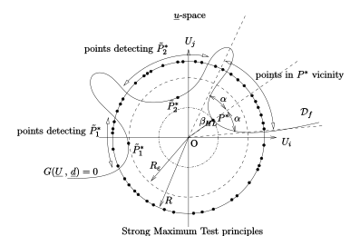
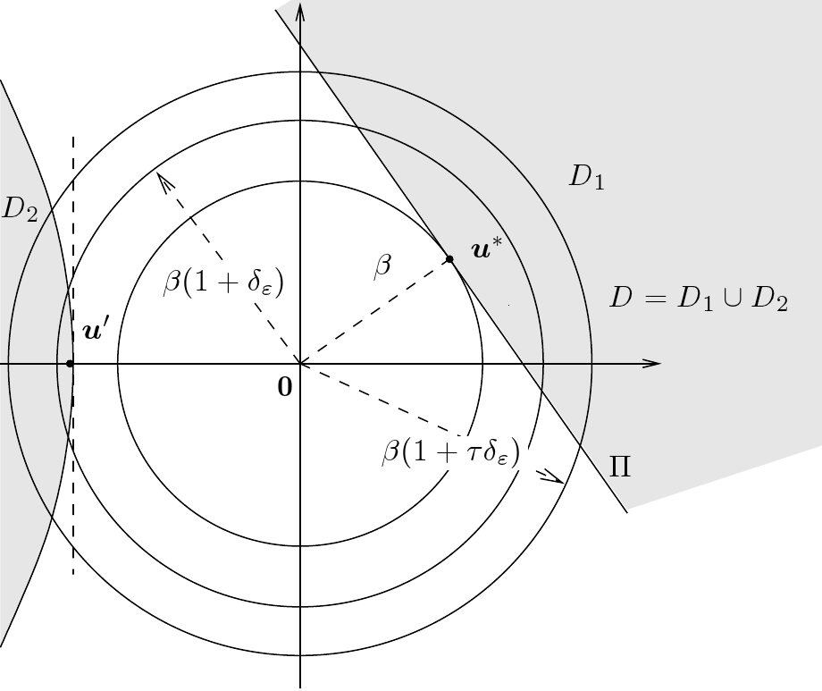

Strong Maximum Test
-------------------

| The Strong Maximum Test is used under the following context:
  :math:`\vect{X}` denotes a random input vector, representing the
  sources of uncertainties, :math:`\pdf` its joint density probability,
  :math:`\vect{d}` a deterministic vector, representing the fixed
  variables :math:`g(\vect{X}\,,\,\vect{d})` the limit state function of
  the model,
  :math:`\cD_f = \{\vect{X} \in \Rset^n \, / \, g(\vect{X}\,,\,\vect{d}) \le 0\}`
  the event considered here and :math:`{g(\vect{X}\,,\,\vect{d}) = 0}`
  its boundary (also called limit state surface).
| The probability content of the event :math:`\cD_f`:

  .. math::
    :label: PfX12

     \begin{aligned}
         P_f &=&     \int_{{g(\vect{X}\,,\,\vect{d}) \le 0}}  \pdf\, d\vect{x}.
       \end{aligned}

  may be evaluated with the FORM or SORM method.

| In order to evaluate an approximation of :math:`P_f`, these analytical
  methods uses the Nataf isoprobabilistic transformation which maps the
  probabilistic model in terms of :math:`\vect{X}` onto an equivalent
  model in terms of :math:`n` independent standard normal random
  :math:`\vect{U}` (refer to to have details on the transformation). In
  that new :math:`\vect{u}`-space, the event has the new expression
  defined from the transformed limit state function of the model
  :math:`G` :
  :math:`\cD_f = \{\vect{U} \in \Rset^n \, / \, G(\vect{U}\,,\,\vect{d}) \le 0\}`
  and its boundary:
  :math:`\{\vect{U} \in \Rset^n \, / \,G(\vect{U}\,,\,\vect{d}) = 0\}`.
| These analytical methods rely on the assumption that most of the
  contribution to :math:`P_f` comes from points located in the vicinity
  of a particular point :math:`P^*`, the design point, defined in the
  :math:`\vect{u}`-space as the point located on the limit state surface
  and of maximal likelihood. Given the probabilistic characteristics of
  the :math:`\vect{u}`-space, :math:`P^*` has a geometrical
  interpretation : it is the point located on the event boundary and at
  minimal distance from the center of the :math:`\vect{u}`-space. Thus,
  the design point :math:`P^*` is the result of a constrained
  optimization problem.
| The FORM/SORM methods suppose that :math:`P^*` is unique.
| One important difficulty comes from the fact that numerical method
  involved in the determination of :math:`P^*` gives no guaranty of a
  global optimum : the point to which it converges might be a local
  optimum only. In that case, the contribution of the points in the
  vicinity of the real design point is not taken into account, and this
  contribution is the most important one.
| Furthermore, even in the case where the global optimum has really been
  found, there may exist another local optimum :math:`\tilde{P}^*` which
  likelihood is slightly inferior to the design point one, which means
  its distance from the center of the :math:`\vect{u}`-space is slightly
  superior to the design point one. Thus, points in the vicinity of
  :math:`\tilde{P}^*` may contribute significantly to the probability
  :math:`P_f` and are not taken into account in the FORM and SORM
  approximations.
| In these both cases, the FORM and SORM approximations are of bad
  quality because they neglect important contributions to :math:`P_f` .
| The Strong Maximum Test helps to evaluate the quality of the design
  point resulting from the optimization algorithm. It checks whether the
  design point computed is:

-  the *true* design point, which means a global maximum point,

-  a *strong* design point, which means that there is no other local
   maximum located on the event boundary and which likelihood is
   slightly inferior to the design point one.

| This verification is very important in order to give sense to the FORM
  and SORM approximations.

| The principle of the Strong Maximum Test relies on the geometrical definition
  of the design point.
| The objective is to detect all the points :math:`\tilde{P}^*` in the
  ball of radius :math:`R_{\varepsilon} = \beta(1+\delta_{\varepsilon})`
  which are potentially the real design point (case of
  :math:`\tilde{P}_2^*`) or which contribution to :math:`P_f` is not
  negligible as regards the approximations Form and SORM (case of
  :math:`\tilde{P}_1^*`). The contribution of a point is considered as
  negligible when its likelihood in the :math:`\vect{u}`-space is more
  than :math:`\varepsilon`-times lesser than the design point one. The
  radius :math:`R_{\varepsilon}` is the distance to the
  :math:`\vect{u}`-space center upon which points are considered as
  negligible in the evaluation of :math:`P_f`.
| In order to catch the potential points located on the sphere of radius
  :math:`R_{\varepsilon}` (frontier of the zone of prospection), it is
  necessary to go a little further more : that’s why the test samples
  the sphere of radius :math:`R = \beta(1+\tau \delta_{\varepsilon})`,
  with :math:`\tau >0`.
| Points on the sampled sphere which are in the vicinity of the design
  point :math:`P^*` are less interesting than those verifying the event
  and located *far* from the design point : these last ones might reveal
  a potential :math:`\tilde{P}^*` which contribution to :math:`P_f` has
  to be taken into account. The vicinity of the design point is defined
  with the angular parameter :math:`\alpha` as the cone centered on
  :math:`P^*` and of half-angle :math:`\alpha`.
| The number :math:`N` of the simulations sampling the sphere of radius
  :math:`R` is determined to ensure that the test detect with a
  probability greater than :math:`(1 - q)` any point verifying the event
  and outside the design point vicinity.

The vicinity of the Design Point is the arc of the sampled sphere which
is inside the half space which frontier is the linearized limit state
function at the Design Point: the vicinity is
the arc included in the half space :math:`D_1`.

The Strong Maximum Test proceeds as follows. The User selects the
parameters:

-  the importance level :math:`\varepsilon`, where
   :math:`0 < \varepsilon < 1`,

-  the accuracy level :math:`\tau`, where :math:`\tau >0`,

-  the confidence level :math:`(1 - q)` where :math:`0<q<1` or the
   number of points :math:`N` used to sample the sphere. The parameters
   are deductible from one other.

| The Strong Maximum Test will sample the sphere of radius
  :math:`\beta(1+\tau  \delta_{\varepsilon})`, where
  :math:`\delta_{\varepsilon} = \sqrt{1 - 2 \frac{\ln(\varepsilon)}{\beta^2}}- 1`.
| The test will detect with a probability greater than :math:`(1 - q)`
  any point of :math:`\cD_f` which contribution to :math:`P_f` is not
  negligeable (i.e. which density value in the :math:`\vect{u}`-space is
  greater than :math:`\varepsilon` times the density value at the design
  point).

| The Strong Maximum Test provides:

-  set 1: all the points detected on the sampled sphere that are in
   :math:`\cD_f` and outside the design point vicinity, with the
   corresponding value of the limit state function,

-  set 2: all the points detected on the sampled sphere that are in
   :math:`\cD_f` and in the design point vicinity, with the
   corresponding value of the limit state function,

-  set 3: all the points detected on the sampled sphere that are
   outside :math:`\cD_f` and outside the design point vicinity, with the
   corresponding value of the limit state function,

-  set 4: all the points detected on the sampled sphere that are
   outside :math:`\cD_f` but in the vicinity of the design point, with
   the corresponding value of the limit state function.

Points are described by their coordinates in the :math:`\vect{x}`-space.

| The parameter :math:`\tau` is directly linked to the hypothesis
  according to which the boundary of the space :math:`\cD_f` is supposed
  to be well approximated by a plane near the design point, which is
  primordial for a FORM approximation of the probability content of
  :math:`\cD_f`. Increasing :math:`\tau` is increasing the area where
  the approximation FORM is applied.
| The parameter :math:`\tau` also serves as a measure of distance from
  the design point :math:`\vect{OP}^*` for a hypothetical local maximum:
  the greater it is, the further we search for another local maximum.
| Numerical experiments show that it is recommanded to take
  :math:`\tau \leq 4` (see the given reference below).
| The following table helps to quantify the parameters of the test for a
  problem of dimension 5.

+-------------------+-----------------------+----------------+---------------+--------------------------------+-------------+
| :math:`\beta_g`   | :math:`\varepsilon`   | :math:`\tau`   | :math:`1-q`   | :math:`\delta_{\varepsilon}`   | :math:`N`   |
+===================+=======================+================+===============+================================+=============+
| 3.0               | 0.01                  | 2.0            | 0.9           | :math:`4.224 e^{-1}`           | 62          |
+-------------------+-----------------------+----------------+---------------+--------------------------------+-------------+
| 3.0               | 0.01                  | 2.0            | 0.99          | :math:`4.224 e^{-1}`           | 124         |
+-------------------+-----------------------+----------------+---------------+--------------------------------+-------------+
| 3.0               | 0.01                  | 4.0            | 0.9           | :math:`4.224 e^{-1}`           | 15          |
+-------------------+-----------------------+----------------+---------------+--------------------------------+-------------+
| 3.0               | 0.01                  | 4.0            | 0.99          | :math:`4.224 e^{-1}`           | 30          |
+-------------------+-----------------------+----------------+---------------+--------------------------------+-------------+
| 3.0               | 0.1                   | 2.0            | 0.9           | :math:`2.295 e^{-1}`           | 130         |
+-------------------+-----------------------+----------------+---------------+--------------------------------+-------------+
| 3.0               | 0.1                   | 2.0            | 0.99          | :math:`2.295 e^{-1}`           | 260         |
+-------------------+-----------------------+----------------+---------------+--------------------------------+-------------+
| 3.0               | 0.1                   | 4.0            | 0.9           | :math:`2.295 e^{-1}`           | 26          |
+-------------------+-----------------------+----------------+---------------+--------------------------------+-------------+
| 3.0               | 0.1                   | 4.0            | 0.99          | :math:`2.295  e^{-1}`          | 52          |
+-------------------+-----------------------+----------------+---------------+--------------------------------+-------------+
| 5.0               | 0.01                  | 2.0            | 0.9           | :math:`1.698 e^{-1}`           | 198         |
+-------------------+-----------------------+----------------+---------------+--------------------------------+-------------+
| 5.0               | 0.01                  | 2.0            | 0.99          | :math:`1.698 e^{-1}`           | 397         |
+-------------------+-----------------------+----------------+---------------+--------------------------------+-------------+
| 5.0               | 0.01                  | 4.0            | 0.9           | :math:`1.698 e^{-1}`           | 36          |
+-------------------+-----------------------+----------------+---------------+--------------------------------+-------------+
| 5.0               | 0.01                  | 4.0            | 0.99          | :math:`1.698 e^{-1}`           | 72          |
+-------------------+-----------------------+----------------+---------------+--------------------------------+-------------+
| 5.0               | 0.1                   | 2.0            | 0.9           | :math:`8.821  e^{-2}`          | 559         |
+-------------------+-----------------------+----------------+---------------+--------------------------------+-------------+
| 5.0               | 0.1                   | 2.0            | 0.99          | :math:`8.821 e^{-2}`           | 1118        |
+-------------------+-----------------------+----------------+---------------+--------------------------------+-------------+
| 5.0               | 0.1                   | 4.0            | 0.9           | :math:`8.821  e^{-2}`          | 85          |
+-------------------+-----------------------+----------------+---------------+--------------------------------+-------------+
| 5.0               | 0.1                   | 4.0            | 0.99          | :math:`8.821 e^{-2}`           | 169         |
+-------------------+-----------------------+----------------+---------------+--------------------------------+-------------+

+-------------------+-----------------------+----------------+-------------+--------------------------------+---------------+
| :math:`\beta_g`   | :math:`\varepsilon`   | :math:`\tau`   | :math:`N`   | :math:`\delta_{\varepsilon}`   | :math:`1-q`   |
+===================+=======================+================+=============+================================+===============+
| 3.0               | 0.01                  | 2.0            | 100         | :math:`4.224e^{-1}`            | 0.97          |
+-------------------+-----------------------+----------------+-------------+--------------------------------+---------------+
| 3.0               | 0.01                  | 2.0            | 1000        | :math:`4.224e^{-1}`            | 1.0           |
+-------------------+-----------------------+----------------+-------------+--------------------------------+---------------+
| 3.0               | 0.01                  | 4.0            | 100         | :math:`4.224e^{-1}`            | 1.0           |
+-------------------+-----------------------+----------------+-------------+--------------------------------+---------------+
| 3.0               | 0.01                  | 4.0            | 1000        | :math:`4.224e^{-1}`            | 1.0           |
+-------------------+-----------------------+----------------+-------------+--------------------------------+---------------+
| 3.0               | 0.1                   | 2.0            | 100         | :math:`2.295e^{-1}`            | 0.83          |
+-------------------+-----------------------+----------------+-------------+--------------------------------+---------------+
| 3.0               | 0.1                   | 2.0            | 1000        | :math:`2.295e^{-1}`            | 1.0           |
+-------------------+-----------------------+----------------+-------------+--------------------------------+---------------+
| 3.0               | 0.1                   | 4.0            | 100         | :math:`2.295e^{-1}`            | 1.0           |
+-------------------+-----------------------+----------------+-------------+--------------------------------+---------------+
| 3.0               | 0.1                   | 4.0            | 1000        | :math:`2.295e^{-1}`            | 1.0           |
+-------------------+-----------------------+----------------+-------------+--------------------------------+---------------+
| 5.0               | 0.01                  | 2.0            | 100         | :math:`1.698e^{-1}`            | 0.69          |
+-------------------+-----------------------+----------------+-------------+--------------------------------+---------------+
| 5.0               | 0.01                  | 2.0            | 1000        | :math:`1.698e^{-1}`            | 1.0           |
+-------------------+-----------------------+----------------+-------------+--------------------------------+---------------+
| 5.0               | 0.01                  | 4.0            | 100         | :math:`1.698e^{-1}`            | 1.0           |
+-------------------+-----------------------+----------------+-------------+--------------------------------+---------------+
| 5.0               | 0.01                  | 4.0            | 1000        | :math:`1.698e^{-1}`            | 1.0           |
+-------------------+-----------------------+----------------+-------------+--------------------------------+---------------+
| 5.0               | 0.1                   | 2.0            | 100         | :math:`8.821 e^{-2}`           | 0.34          |
+-------------------+-----------------------+----------------+-------------+--------------------------------+---------------+
| 5.0               | 0.1                   | 2.0            | 1000        | :math:`8.821 e^{-2}`           | 0.98          |
+-------------------+-----------------------+----------------+-------------+--------------------------------+---------------+
| 5.0               | 0.1                   | 4.0            | 100         | :math:`8.821 e^{-2}`           | 0.93          |
+-------------------+-----------------------+----------------+-------------+--------------------------------+---------------+
| 5.0               | 0.1                   | 4.0            | 1000        | :math:`8.821 e^{-2}`           | 0.99          |
+-------------------+-----------------------+----------------+-------------+--------------------------------+---------------+

As the Strong Maximum Test involves the computation of :math:`N` values
of the limit state function, which is computationally intensive, it is
interesting to have more than just an indication about the quality of
:math:`\vect{OP}^*`. In fact, the test gives some information about the
trace of the limit state function on the sphere of radius
:math:`\beta(1+\tau \delta_{\varepsilon})` centered on the origin of the
:math:`\vect{u}`-space. Two cases can be distinguished:

-  | Case 1: set 1 is empty. We are confident on the fact that
     :math:`\vect{OP}^*` is a design point verifying the hypothesis
     according to which most of the contribution of :math:`P_f` is
     concentrated in the vicinity of :math:`\vect{OP}^*`. By using the
     value of the limit state function on the sample
     :math:`(\vect{U}_1, \dots, \vect{U}_N)`, we can check if the limit
     state function is reasonably linear in the vicinity of
     :math:`\vect{OP}^*`, which can validate the second hypothesis of
     FORM.
   | If the behaviour of the limit state function is not linear, we can
     decide to use an importance sampling version of the Monte Carlo
     method for computing the probability of failure.
     However, the information obtained through the Strong Max Test,
     according to which :math:`\vect{OP}^*` is the actual design point,
     is quite essential : it allows to construct an effective importance
     sampling density, e.g. a multidimensional Gaussian distribution
     centered on :math:`\vect{OP}^*`.

-  Case 2: set 1 is not empty. There are two possibilities:

   #. We have found some points that suggest that :math:`\vect{OP}^*` is
      not a strong maximum, because for some points of the sampled
      sphere, the value taken by the limit state function is slightly
      negative;

   #. | We have found some points that suggest that :math:`\vect{OP}^*`
        is not even the global maximum, because for some points of the
        sampled sphere, the value taken by the limit state function is
        very negative.
      | In the first case, we can decide to use an importance sampling
        version of the Monte Carlo method for computing the probability
        of failure, but with a mixture of e.g. multidimensional gaussian
        distributions centered on the :math:`U_i` in :math:`\cD_f`
        (refer to ). In the second case, we can restart the search of
        the design point by starting at the detected :math:`U_i`.

.. topic:: API:

    - See :class:`~openturns.StrongMaximumTest`
    - See :class:`~openturns.FORM`

.. topic:: Examples:

    - See :doc:`/examples/reliability_sensitivity/strong_maximum_test`

.. topic:: References:

    - A. Dutfoy, R. Lebrun, 2006, "The Strong Maximum Test: an efficient way to assess the quality of a design point", PSAM8, New Orleans.
