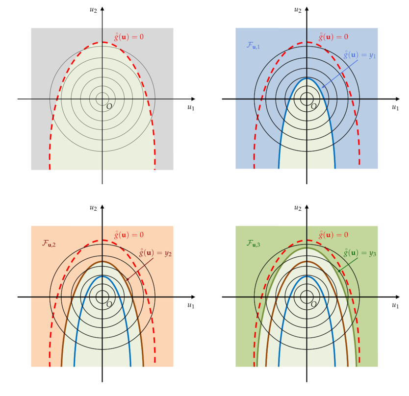

Subset sampling method
======================

Acknowledgement
^^^^^^^^^^^^^^^

The text and the figures thereafter come from Vincent Chabridon's PhD thesis,
**Reliability-oriented sensitivity analysis under probabilistic model uncertainty, Application to aerospace systems** (2018)
in the chapter 3: *Rare event probability estimation*.
This paragraph has been edited with the kind permission of its author.

Presentation
^^^^^^^^^^^^

*Subset sampling* (abbreviated to SS) belongs to the family of variance
reduction techniques. However, due to its mathematical formulation,
several variants have been proposed in different scientific
communities. For example, one can cite, among others, the pioneering
work of Kahn and Harris (1951) (called *splitting*) in the field of
neutronics physics, the study of Glasserman *et al.* (1999) (called *multilevel splitting*) from the branching processes point of view, the development
by Au and Beck (2001) (called *subset simulation*) for reliability assessment purpose or finally,
the theoretical studies from the Markov processes point of view by Cérou and Guyader (2007)
(called *adaptive multilevel splitting*) and Cérou et al. (2012) from the sequential Monte Carlo point
of view.

All in all, these splitting techniques rely on the same idea: a rare event should be “split” into
several less rare events, these events corresponding to some “subsets” containing the true failure
set. Thus, the probability associated to each subset should be stronger, and consequently, easier
to estimate.
As an example, on can illustrate this by considering that a failure probability
:math:`p_f` of the order of :math:`10^{-m}` can be split into a product of
:math:`m` terms of probability :math:`1/10`.
In the following, for the sake of conciseness, only the formulation proposed by Au and Beck (2001) is discussed.

Formulation
^^^^^^^^^^^

The formulation of SS proposed by Au and Beck (2001) is
derived in the :math:`\mathbf{u}` -space (standard space) and is the one presented hereafter.

Let :math:`E = \{ \overset{\circ}{g}(u) \leq 0 \}` denote a failure event sufficiently rare, where :math:`\overset{\circ}{g}` is the *limit state function* (LSF) in the standard space.

One can consider a set of *intermediate nested events* :math:`E_s` with :math:`s = 1, \hdots, m` such that :math:`E = E_m \subset E_{m-1} \subset \hdots \subset E_2 \subset E_1`.
Applying chain rule for conditional probabilities, one gets:

.. math::
   \begin{aligned}
      p_f {} & =  \mathbb{P}(E_m) \\
          {} & =   \mathbb{P}(E_m | E_{m-1}) \mathbb{P}(E_{m-1})  \\
          {} & =   \mathbb{P}(E_m | E_{m-1}) \mathbb{P}(E_{m-1})  \\
          {} & =   \prod_{s=1}^m p_s
   \end{aligned}

where :math:`p_1 = \mathbb{P}(E_1)` and :math:`p_s = \mathbb{P}(E_s | E_{s-1})` for :math:`s = 2, \hdots, m`.
From this collection of nested failure events, one can define a set of *intermediate nested failure domains* (which are the so-called “subsets”) such that:

.. math::
   \mathcal{F}_{u,s} = \{ u \in \mathbb{R}^d | \overset{\circ}{g}(u) \leq y_s   \}, s=1,\hdots,m

where :math:`y_s` belongs to a set of decreasing intermediate thresholds such that :math:`y_m = 0` (i.e., corresponding to the true LSF) and

.. math::
   y_1 > y_2 > \hdots > y_{m-1} > y_m

These thresholds are estimated as :math:`\alpha_{SS}` quantiles from the set of :math:`N` samples of LSF outputs
:math:`\mathcal{G}_{u,s} = \{ \overset{\circ}{g}(U^{(j)}) \}_{j=1}^N` with :math:`\alpha_{SS} \in ]0, 1[` the *rarity parameter*.
Consequently, one can notice that

.. math::
   \mathcal{F}_{u} = \mathcal{F}_{u,m} \subset \mathcal{F}_{u,m-1} \subset \hdots \subset \mathcal{F}_{u,2} \subset \mathcal{F}_{u,1}

The underlying mechanism of the SS is illustrated on a two-dimensional example in the following figure.

  Illustration on a two-dimensional example of the SS mechanism in the standard space.
  (Top left) The true but unknown *limit state surface* ; (Top right) First intermediate failure domain :math:`\mathcal{F}_{u,1}`.
  (Bottom left) Second intermediate failure domain :math:`\mathcal{F}_{u,2}` ; (Bottom right) Third intermediate failure domain :math:`\mathcal{F}_{u,3}`.

In the first figure (top left), the true, but unknown, *limit state surface* (LSS) is sketched. Then, one considers successive intermediate nested failure domains
which adaptively evolve towards the true failure LSS (first, second and third intermediate failure domains).
Thus, the rare event estimation problem can be split into a sequence of :math:`m` subproblems with larger probabilities to estimate. For the first level :math:`s=1`, the probability reads :

.. math::
   p_1 = \mathbb{P}(E_1) = \mathbb{E}_{\Phi_d} [ \mathbf{1}_{ \mathcal{F}_{u,1}  }(U) ]

and for :math:`s=2,\hdots,m` :

.. math::
   p_s = \mathbb{P}(E_s | E_{s-1}) = \mathbb{E}_{\Phi_d(.|E_{s-1})} [ \mathbf{1}_{ \mathcal{F}_{u,s}  }(U) ].

where :math:`\Phi_d` is the usual standard unit Gaussian PDF in dimension :math:`d`.

The associated estimators are given, respectively for :math:`\{ U_1^{(j)} \}_{j=1}^N \overset{i.i.d.}{\sim} \Phi_d` by:

.. math::
   \hat{p_1} = \frac{1}{N} \sum_{j=1}^N \mathbf{1}_{ \mathcal{F}_{u,1} }(U_1^{(j)})

and, for :math:`\{ U_s^{(j)} \}_{j=1}^N \overset{i.i.d.}{\sim} \Phi_d(.|E_{s-1})`, :math:`s \geq 2`, by:

.. math::
   \hat{p_s} = \frac{1}{N} \sum_{j=1}^N \mathbf{1}_{ \mathcal{F}_{u,s} }(U_s^{(j)})

where :math:`N` denotes the number of samples, supposed to be a constant for each level :math:`y_s`, and the indicator function satisfies
:math:`\mathbf{1}_{\mathcal{F}_{u,s-1}}(u) = 1` if :math:`\overset{\circ}{g}(u) \leq y_{s-1}` and :math:`\mathbf{1}_{\mathcal{F}_{u,s-1}}(u) = 0` otherwise.

Basically, the SS estimator for :math:`p_f` is given by:

.. math::
   \hat{p}_f^{SS} = \hat{p_1} \prod_{s=2}^m \hat{p_s} \qquad \text{ (estimator) }.

Moreover, it appears that the conditional sampling PDF :math:`\Phi_d(.|E_{s-1})` takes the form:

.. math::
   \begin{aligned}
   \Phi_d(u|E_{s-1}) {} & = \frac{\Phi_d(u) \mathbf{1}_{\mathcal{F}_{u,s-1}}(u) }{ \mathbb{P}(E_{s-1}) } \\
                     {} & = \frac{\Phi_d(u) \mathbf{1}_{\mathcal{F}_{u,s-1}}(u) }{p_{s-1}}, s=2,\hdots,m \qquad \text{ (auxiliary PDF)  }
   \end{aligned}

As a consequence, if one does want to achieve variance reduction with SS compared to Crude MonteCarlo
(and thus, to decrease the computational cost in context of very low failure probability), one
should be able to sample sequentially from a quasi-optimal auxiliary PDF.

Such a problem can be addressed by using dedicated algorithms based on the *Markov Chain Monte
Carlo* (MCMC) sampling technique (see, e.g., Robert and Casella, 2004; Asmussen and Glynn,
2007).

For instance, dedicated algorithms such as the standard *Metropolis-Hastings* (MH) sampler (Metropolis et al., 1953; Hastings, 1970) can be used.
In the specific context of SS, the *modified Metropolis-Hastings* (m-MH) sampler originally proposed by Au and Beck (2001) has been proposed to deal
with possible higher-dimensional reliability problems than the ones standard MH algorithm traditionally used.

Concerning the statistical properties of the estimator of :math:`p_f^{SS}`,
Au and Beck (2001) point out the fact that this estimator is biased due to the
correlation between the intermediate probability estimators :math:`\hat{p}_s`
for :math:`s=1,\hdots,m`.
Such a correlation comes from the way the m-MH sampler is seeded at each step
(see, e.g., Bourinet (2018) or Dubourg (2011) for more details).
It is also proved that the estimator :math:`p_f^{SS}` is asymptotically unbiased (Au and Beck, 2001).
As for the c.v. :math:`\delta_{\hat{p}_f^{SS}}`, Au and Beck (2001) show that it is bounded such that:

.. math::

    \sum_{s=1}^m \delta_{s} \leq  \delta^2_{\hat{p}_f^{SS}}  \leq  \sum_{s_1=1}^m \sum_{s_2=1}^m \delta_{s_1} \delta_{s_2} \qquad \text {(3)}

where :math:`\delta^2_{\hat{p}_f^{SS}} = \mathbb{E} \left[ \left( \frac{\hat{p}_f^{SS} -p_f  }{p_f} \right)^2 \right]`
and :math:`\delta_s` are the c.v. of :math:`\hat{p_s}`, for :math:`s=1,\hdots,m`.
For the sake of concisness, formulas for computing these quantities can be found in Au and Beck (2001) or Bourinet (2018).

The upper bound is established under the assumption of fully-correlated intermediate probability estimators :math:`\hat{p}_s`.
Instead of using this upper bound, one can use the lower bound, established
under the assumption of independent probability estimators :math:`\hat{p}_s`.
Indeed, although it underestimates the true c.v., it appears that,in practice (see, e.g., Au *et al.*, 2007),
it may give a reasonable approximation and approaches the empirical c.v. obtained by repetitions of the SS algorithm.

Advantages and drawbacks
^^^^^^^^^^^^^^^^^^^^^^^^

On the one hand, the main advantages of SS in rare event probability estimation are its
ability to handle complex LSFs (e.g., highly nonlinear, with possibly
multiple failure regions) and to behave better than other techniques
regarding the input dimension. Moreover, SS may present some
interesting features concerning possible parallelization as exposed in
Bourinet (2018). However, in its traditional formulation, SS is not a
fully parallel multilevel splitting (Walter, 2015).

On the other hand, SS also presents some potential drawbacks. Firstly, even if SS
provides a variance reduction compared to CMC, the number of samples
required to achieve convergence may be, in some cases, larger than
that required with other *Importance Sampling* techniques. Secondly, the estimation
error is not directly given by an analytical formula (e.g., variance
estimators for CMC and IS) but has to be estimated using the bounds
provided in the previous inequalities or by repetition.

Thirdly, another intrinsic difficulty of SS is the tuning of parameters (e.g., the fixed
vs. adaptive levels :math:`\{ y_s \}_{s=1}^m` , the number of samples :math:`N` per step
and other related parameters in the MCMC algorithm) which can be, in
some cases, very influential on the efficiency of the
algorithm. Fourthly, as proved in Au and Beck (2001) and recalled by
Walter (2016, Chap. 1), the SS formulation leads to a biased estimator of :math:`p_f`.

Other algorithms such as the *Last Particle Algorithm* (LPA) by
Guyader et al. (2011) or the *Moving Particles algorithm* (MP) by
Walter (2015) can be used. A numerical investigation about relative
efficiencies of both SS and LPA/MP through the tuning of MCMC
parameters has been recently proposed by Proppe (2017).

Fourthly, when input dimension :math:`d` is large, SS may be indirectly affected if the
traditional MH sampler is used as it becomes inefficient in high dimension. Using the m-MH sampler introduced by Au and Beck (2001)
allows one to overcome this difficulty. As an alternative, one could
also use another variant of m-MH as proposed in Zuev and Katafygiotis
(2011).

Finally, as mentioned in Au and Wang (2014) and Breitung
(2019), counterexamples (e.g., specific shapes of LSS) can be found
to invalidate SS convergence towards the true failure
probability. This remark highlights the fact that any insight
regarding the physical behavior of the system or about the LSF can be
useful for the analyst to avoid dramatic errors in terms of rare event
probability estimation.

Remarks
^^^^^^^

As a remark, one can notice that *Subset Sampling*
can be efficiently coupled with surrogate models (Bourinet et al.,
2011; Bourinet, 2016; Bect et al., 2017) to assess reliability
regarding *expensive-to-evaluate* computer models. In such a case,
possible limiting properties of the surrogate model (e.g., limits
concerning the input dimensionality and the smoothness of the LSF) may
impact the usual properties of *Subset Sampling*.

References
^^^^^^^^^^

For any further information about subset/splitting techniques for rare event simulation, the
interested reader could refer to the following references

  - Asmussen and Glynn, 2007, *Stochastic Simulation: Algorithms and Analysis*
  - Au and Beck, 2001, *Estimation of small failure probabilities in high dimensions by subset simulation*
  - Au *et al.*, 2007, *Application of subset simulation methods to reliability benchmark problems*
  - Au and Wang, 2014, *Engineering Risk Assessment with Subset Simulation*
  - Bect *et al.*, 2017, *Bayesian Subset Simulation*
  - Bourinet *et al.*, 2011, *Assessing small failure probabilities by combined subset simulation and Support Vector Machines*
  - Bourinet, 2016, *Rare-event probability estimation with adaptive support vector regression surrogates*
  - Bourinet (2018), *Reliability analysis and optimal design under uncertainty – Focus on adaptive surrogate-based approaches*
  - Breitung, 2019, *The geometry of limit state function graphs and subset simulation: Counterexamples*
  - Caron *et al.*, 2014, *Some recent results in rare event estimation*
  - Cérou and Guyader, 2007, *Adaptive Multilevel Splitting for Rare Event Analysis*
  - Cérou *et al.*, 2012, *Sequential Monte Carlo for rare event estimation*
  - Chabridon, 2018, *Reliability-oriented sensitivity analysis under probabilistic model uncertainty, Application to aerospace systems*
  - Dubourg, 2011, *Adaptive surrogate models for reliability analysis and reliability-based design optimization*
  - Glasserman *et al.*, 1999 , *Multilevel splitting for estimating rare event probabilities*
  - Guyader *et al.*, 2011, *Simulation and Estimation of Extreme Quantiles and Extreme Probabilities*
  - Hastings, 1970, *Monte Carlo sampling methods using Markov chains and their applications*
  - Kahn and Harris, 1951, *Estimation of particle transmission by random sampling*
  - Lagnoux, 2006, *Rare event simulation*
  - Metropolis *et al.*, 1953, *Equation of state calculations by fast computing machines*
  - Morio *et al.*, 2014, *A survey of rare event simulation methods for static input-output models*
  - Proppe, 2017, *Markov chain methods for reliability estimation*
  - Robert and Casella, 2004, *Monte Carlo Statistical Methods*
  - Walter, 2015, *Moving particles: A parallel optimal multilevel splitting method with application in quantiles estimation and meta-model based algorithms*
  - Walter, 2016, *Using Poisson processes for rare event simulation*
  - Zuev and Katafygiotis, 2011, *Modified Metropolis-Hastings algorithm with delayed rejection*

.. topic:: API:

    - See :class:`~openturns.SubsetSampling`

.. topic:: Examples:

    - See :doc:`/auto_reliability_sensitivity/reliability/plot_subset_sampling`

