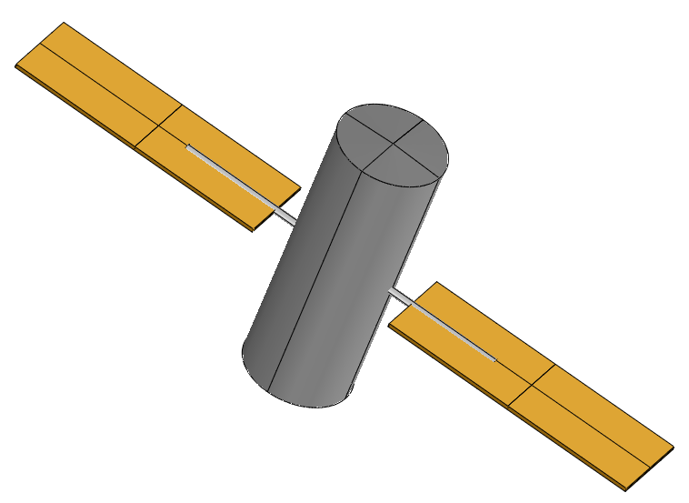
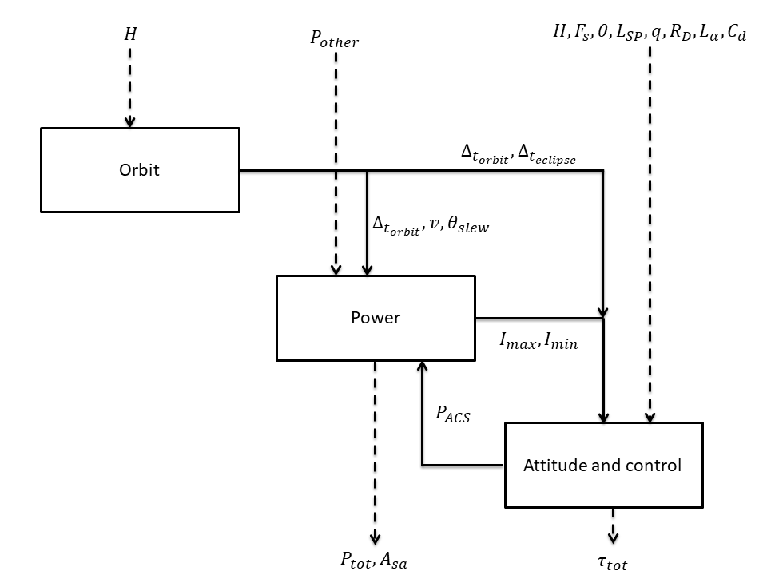

.. _use-case-fireSatellite:

The Fire Satellite model
========================

The fire satellite model is a multidisciplinary test case that involves 3 disciplines: Power, Orbit and Attitude \& control. This usecase has been firstly proposed by Wertz et al. The model deals with the design of a realistic satellite which goals are to detect and monitor forest fires from Earth's orbit, through the use of optical sensors. Three disciplines are needed to design this satellite. The orbit discipline is responsible of computing the orbit period, the satellite velocity, the maximal slewing angle and the eclipse period. The power discipline is used to estimate the total power of the system and the area of the solar arrays. Finally, the attitude \& control discipline computes the total torque of the satellite and the power required for the attitude control system.
These disciplines exchange several coupling variables. The multidisciplinary analysis that is used to compute the converged values of the coupling variables is performed through a Fixed Point Iteration algorithm.

    
    
This test case is composed of nine aleatory variables:

- :math:`H \sim\mathcal{N}(18e6, 1e6)`, the altitude (m)

- :math:`P_{other} \sim\mathcal{N}(1000, 50)`, the power other than attitude control system (W)

- :math:`F_{s} \sim\mathcal{N}(1400, 20)`, the average solar flux (W/m2)

- :math:`\theta \sim\mathcal{N}(15, 1)`, the deviation of moment axis (deg)

- :math:`L_{sp} \sim\mathcal{N}(2, 0.4)`, the moment arm for radiation torque (m)

- :math:`q \sim\mathcal{N}(0.5, 1)`, the reflectance factor (-)

- :math:`R_D \sim\mathcal{N}(5,1)`, the residual dipole of spacecraft (A.m2)

- :math:`L_\alpha \sim\mathcal{N}(2,0.4)`, the moment arm for aerodynamic torque (m)

- :math:`C_d \sim\mathcal{N}(1,0.3)`, the drag coefficient (-)

The three outputs of interest are :

- :math:`\tau_{torque}`, the total torque of the satellite (m)

- :math:`P_{tot}`, the total power of the satellite (W)

- :math:`A_{sa}`, the area of the solar array (m2)

Different deterministic quantities also present :

- :math:`c` :  the speed of light, 2.9979e8 m/s 

- :math:`\omega_{max}` : the maximum rotational velocity of reaction wheel, 6000 rpm

- :math:`n` : the number of reaction wheels that could be active, 3

- :math:`\delta_{\theta_{slew}}` : the slewing time period, 760 s

- :math:`A_s` : the area reflecting radiation, 13.85 m2

- :math:`i` : the sun incidence angle, 0 deg

- :math:`M` :  the magnetic moment of earth, 7.96e15 A.m2

- :math:`\rho` : the atmospheric density, 5.1480e-11 kg/m3

- :math:`A` : the cross-sectional in flight direction, 13.85 m2

- :math:`P_{hold}` : the holding power, 20 W

- :math:`\mu` :  the Earth gravity constant, 398600.4418e9 m3/s2

- :math:`Id` : the inherent degradation of array, 0.77

- :math:`t` : the thickness of solar panels, 0.005 m

- :math:`n_{sa}` : the number of solar arrays, 3

- :math:`\epsilon_{deg}` : the degradation in power production capability, 0.0375 percent per year

- :math:`LT` : the lifetime of spacecraft, 15 years

- :math:`r_{lw}` : the length to width ratio of solar array, 3

- :math:`D` : the distance between panels, 2 m

- :math:`I_{bodyX}` : the inertia of body, X axis, 6200 kg.m2

- :math:`I_{bodyY}` : the inertia of body, Y axis, 6200 kg.m2

- :math:`I_{bodyZ}` : the inertia of body, Z axis, 4700 kg.m2

- :math:`\rho_{sa}` : the average mass density to arrays, 700 kg.m3

- :math:`\eta` :  the power efficiency, 0.22

- :math:`\phi_{target}` : the target diameter, 235000 m

- :math:`R_E` : the Earth radius, 6378140 m

We assume that the input variables are independent.

The following figure depicts the interaction between the disciplines.    

The orbit discipline is defined as follows. First, the satellite velocity :math:`v` is computed from the Earth radius :math:`R_E` and the altitude :math:`H` .

.. math::
    v = \sqrt{\frac{\mu}{R_E+H}}

with :math:`\mu` the Earth gravity constant. Then, the orbit period :math:`\Delta_{t_{orbit}}` is calculated,

.. math::
    \Delta_{t_{orbit}} = \frac{2\pi(R_E+H)}{v}

The eclipse period :math:`\Delta_{t_{ecplise}}` and maximum slewing angle :math:`\theta_{slew}` are then computed,

.. math::
    \Delta_{t_{ecplise}} = \frac{\Delta_{t_{orbit}}}{\pi}\arcsin\left(\frac{R_E}{R_E+H}\right)

.. math::
    \theta_{slew} = \arctan\left(\frac{\sin\left(\frac{\phi_{target}}{R_E}\right)}{1-\cos\left(\frac{\phi_{target}}{R_E}\right)+\frac{H}{R_E}} \right)

with :math:`\phi_{target}` the target diameter.

The attitude and control discipline is governed by the following equations.

.. math::
    \tau_{tot} = \max(\tau_{slew},\tau_{dist})

with

.. math::
    \tau_{slew} = \frac{4\theta_{slew}}{\Delta t_{slew}^2} I_{max}

and 

.. math::
    \tau_{dist} = \sqrt{\tau_g^2 + \tau_{sp}^2 + \tau_m^2 + \tau_a^2}

.. math::
    \tau_{g} = \frac{3\mu}{2(R_E+H)^3}|I_{max}-I_{min}|\sin(2\theta)

.. math::
    \tau_{sp} = L_{sp}\frac{F_s}{C}A_s(1+q)\cos(i)

.. math::
    \tau_{m} = \frac{2 M R_D}{R_E+H)^3}

.. math::
    \tau_{a} = \frac{1}{2} L_{alpha} \rho C_d A v^2

with :math:`\tau_{tot}` the total torque, :math:`\tau_{slew}` the slewing torque, :math:`\tau_{dist}` the disturbance torque, :math:`\tau_{g}` the gravity gradient torque, :math:`\tau_{sp}` the solar radiation torque, :math:`\tau_{m}` the magnetic filed interaction torque, :math:`\tau_{a}` the aerodynamic torque.

The attitude control power :math:`P_{ACS}` is finally defined by

.. math::
    P_{ACS} = \tau_{tot}\omega_{max} + n P_{hold}

The power discipline has 16 inputs and computes the total solar array size and total power by,

.. math::
    P_{tot} = P_{ACS} + P_{other}

.. math::
    A_{sa} = \frac{P_{sa}}{P_{EOL}}

with,

.. math::
    P_{EOL} = P_{BOL}(1-\epsilon_{deg})^{LT},

the power production capability at the end of life, defined by 

.. math::
    P_{BOL} = \eta F_s I_d \cos(i)
    
the power production capability at the beginning of life, and 

.. math::
    P_{sa} = \frac{\left( \frac{P_e T_e}{0.6} + \frac{P_d}{T_d}{0.8} \right)}{T_d}
 
is the required power output. :math:`P_e` and :math:`P_d` are the satellite requirements during eclipse and daylight (here :math:`P_e = P_d = P_{tot}`). :math:`T_e` and :math:`T_d` are the time per orbit spent in eclipse and daylight.

Finally, the inertia can be derived as follows,

.. math::
    I_{min} = \min(I_{totX},I_{totY},I_{totZ}) 

.. math::
    I_{max} = \max(I_{totX},I_{totY},I_{totZ}) 

with :math:`I_{tot} = I_{sa} + I_{body}` the total moment of inertia in the three dimensions, that depends on, 

.. math::
    I_{saX} = m_{sa} \left( \frac{1}{12} (L^2+t^2) + (D+\frac{L}{2})^2 \right)

.. math::
    I_{saY} = m_{sa} (t^2+W^2)

.. math::
    I_{saZ} = m_{sa} \left( \frac{1}{12} (L^2+W^2) + (D+\frac{L}{2})^2 \right)

with :math:`L = \sqrt{\frac{A_{sa} r_{tw}}{n_{sa}}}` the length of the solar array,
:math:`W = \sqrt{\frac{A_{sa}}{r_{tw}n_{sa}}}` the width of the solar array, and
:math:`m_{sa} = 2\rho_{sa}L W t` the mass of the solar array.
   
Two tunings parameters are present : 

- :math:`tolFPI` : the tolerance on the fixed point iteration algorithm used in the multidisciplinary analysis, 1e-3
- :math:`maxFPIIter` : the maximum number of iterations of the fixed point iteration algorithm used in the multidisciplinary analysis, 50

References
----------

* Wertz, J. and Larson, W. (1999) Space Mission Analysis and Design, Microcosm, Inc. Torrance, CA.

* Sankararaman, S., Mahadevan, S. (2012). Likelihood-based approach to multidisciplinary analysis under uncertainty. Journal of Mechanical Design, 134(3):031008

* Zaman, K. (2012). Modeling and management of epistemic uncetainty for multidisciplinary system analysis and design, PhD thesis, Vanderbilt University, USA

Load the use case
-----------------

We can load this model from the use cases module as follows :

.. code-block:: python

    >>> from openturns.usecases import fireSatelitte_function
    >>> m = fireSatelitte_function.FireSatelliteModel()
    >>> # Load the Fire satellite use case (with 3 outputs: total torque, total power and solar array area)
    >>> model = m.model()
    >>> # Load the Fire satellite use case with total torque as output
    >>> modelTotalTorque = m.modelTotalTorque()
    >>> # Load the Fire satellite use case with total power as output
    >>> modelTotalPower = m.modelTotalPower()    
    >>> # Load the Fire satellite use case with solar array area as output
    >>> modelSolarArrayArea = m.modelSolarArrayArea()    

API documentation
-----------------

See :class:`~openturns.usecases.fireSatellite_function.FireSatelliteModel`.

Examples based on this use case
-------------------------------