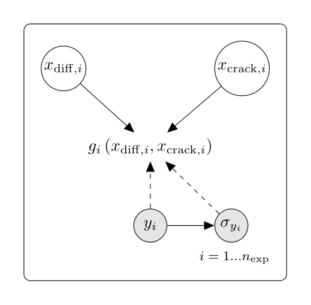

.. _use-case-fission-gas:

Fission gas release
===================

Fuel performance codes [1] like *TRANSURANUS* [2, 3] predict the behavior of nuclear fuel rods,
such as the temperature, internal pressure, and fission gas release.
This use case presents several simplified Gaussian process surrogate models for fission gas release
fitted to training data generated with *TRANSURANUS*.
Fission gas release is expressed as a fraction of what is created by the fission reaction.
They are derived from the work by [robertson2024]_.

Each of the models has two inputs:

- Single atom diffusion multiplier denoted by :math:`x_{\mathrm{diff}}`.
- Fraction released due to micro-cracking, denoted by :math:`x_{\mathrm{crack}}`.

Each model corresponds to different sets of experimental conditions.
The number of different sets of environmental conditions is denoted by :math:`\sampleSize_{\mathrm{exp}}`,
and in the following we use the index :math:`i` (:math:`1 \leq i \leq \sampleSize_{\mathrm{exp}}`)
to identify a given set of environmental conditions.

For each set of environmental conditions :math:`i`, fission gas release
was measured, and the measured value is denoted by :math:`y_i`.
The measured values are extracted from the International Fuel Performance Experiments (IFPE) database.
Measurement uncertainty is represented by a normal distribution
with mean :math:`y_i`, and its standard deviation :math:`\sigma_{y_i}` is a known function of :math:`y_i`:

.. math::
   \sigma_{y_i} = \sqrt{\left( \frac{y_i}{20} \right)^2 + 10^{-4}}

The model corresponding to the environmental conditions :math:`i`
is denoted by :math:`\model_i`.
The values of the single atom diffusion multiplier :math:`x_{\mathrm{diff}, i}`
and of the fraction of gas released due to micro-cracking :math:`x_{\mathrm{crack}, i}`
corresponding to the measured :math:`y_i` are unobserved.

The relationships between these quantities are represented in the following network.
Full arrows represent deterministic relationships,
while dashed arrows represent probabilistic relationships
(e.g. a truncated normal distribution, with truncation bounds determined
by the range of the model).

References
----------

- [1] Van Uffelen, P.,  Hales J., Li, W., Rossiter, G. and Williamson, R. *A review of fuel performance modelling*, J. Nucl. Mater., vol. 516, pp. 373–412, 2019.
- [2] Lassmann K., *TRANSURANUS: a fuel rod analysis code ready for use*,  J. Nucl. Mater., vol. 188, pp. 295–302, 1992. `pdf <https://www.osti.gov/etdeweb/servlets/purl/456135>`__
- [3] Magni, A., Del Nevo, A., Luzzi, L., Rozzia, D., Adorni, M., Schubert, A., and Van Uffelen, P.,
  *The TRANSURANUS fuel performance code*, in Nuclear Power Plant Design and Analysis Codes, Elsevier, 2021, pp. 161–205.
  doi: 10.1016/B978-0-12-818190-4.00008-5.
- [robertson2024]_

Acknowledgement
---------------

The project this use case is derived of was developed as part of WP6 -
"Advance fuel performance modeling" in the EU-supported `APIS project <https://apis-project.eu/>`_,
with the aim to deliver a new calibration methodology
to the stakeholders. Funded by the European Union. Views and opinions expressed on the present page,
and in the examples built upon this use case are however those of the authors
only and do not necessarily reflect those of the European Union or Euratom.
Neither the European Union nor the granting authority can be held responsible for them.
Further, the project was developed with funding from the `Swedish Nuclear Centre <https://www.skc.kth.se/>`_.

API documentation
-----------------

.. currentmodule:: openturns.usecases.fission_gas

.. autoclass:: FissionGasRelease
    :noindex:

Examples based on this use case
-------------------------------

.. minigallery:: openturns.usecases.fission_gas.FissionGasRelease
