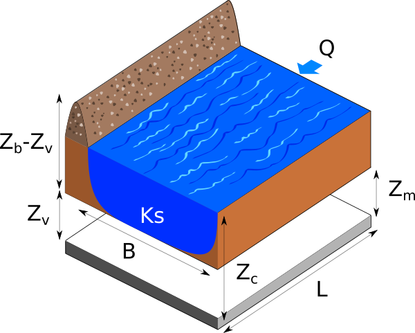
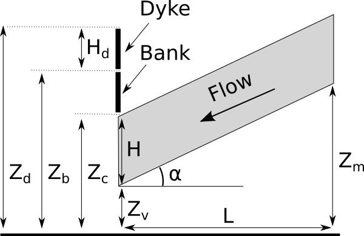

.. _use-case-flood-model:

A flood model
=============

Introduction
------------

The following figure presents a dyke protecting industrial facilities. When the river level exceeds the dyke height, flooding occurs. The model is based on a crude simplification of the 1D hydrodynamical equations of Saint-Venant under the assumptions of uniform and constant flow rate and large rectangular sections.

    Flooding section

Four independent random variables are considered:

  - :math:`Q`: flow rate :math:`[m^3 s^{-1}]`
  - :math:`K_s`: Strickler :math:`[m^{1/3} s^{-1}]`
  - :math:`Z_v`: downstream height :math:`[m]`
  - :math:`Z_m`: upstream height :math:`[m]`

When the Strickler coefficient increases, the riverbed generates less friction. 

The model depends on four parameters:

 * the height of the dyke: :math:`H_d = 3` :math:`[m]`,
 * the altitude of the river banks: :math:`Z_b = 55.5` :math:`[m]`,
 * the river length: :math:`L = 5000` :math:`[m]`,
 * the river width: :math:`B = 300` :math:`[m]`.

The altitude of the dyke is:

 .. math::
    Z_d = Z_b + H_d
 

The slope :math:`\alpha` of the river is assumed to be close to zero, which implies:

 .. math::
    \alpha = \frac{Z_m - Z_v}{L},
 
if :math:`Z_m \geq Z_v`. 

The water depth is:

 .. math::
    H = \left(\frac{Q}{K_s B \sqrt{\alpha}}\right)^{0.6},
 

for any :math:`K_s, Q>0`.

The flood altitude is:

 .. math::
    Z_c = H + Z_v.
 

The altitude of the surface of the water is greater than the altitude of the top of the dyke (i.e. there is a flood) if:

 .. math::
    S = Z_c - Z_d
 
is greater than zero.

The following figure presents the model with more details. 

    Flooding section detail

If we substitute the parameters into the equation, we get:

 .. math::
    S = \left(\frac{Q}{300 Ks \sqrt{(Zm-Zv)/5000}}\right)^{3/5} +Zv-58.5.
 

We assume that the four inputs have the following distributions:

  - :math:`Q` ~ Gumbel(mode=1013, scale=558), :math:`Q` > 0
  - :math:`K_s` ~ Normal(mu=30.0, sigma=7.5), :math:`K_s` > 0
  - :math:`Z_v` ~ Uniform(a=49, b=51)
  - :math:`Z_m` ~ Uniform(a=54, b=56)

Moreover, we assume that the input random variables are independent.

We want to estimate the flood probability:

 .. math::
    P_f = P(S>0).

Analysis of the calibration problem
-----------------------------------

In this section, we analyse why calibrating the parameters of this model 
may raise some difficulties. 

First, the slope :math:`\alpha` only depends on the difference :math:`Z_m - Z_v`.
This is why :math:`Z_v` and :math:`Z_m` cannot be identified at the same time.
In algebraic terms, there is an infinite number of couples :math:`(Z_v, Z_m)` which
generate the same difference :math:`Z_m - Z_v`.

Second, the denominator of the expression of :math:`H` involves the product
:math:`K_s B \sqrt{\alpha}`.
In algebraic terms, there is an infinite number of couples :math:`(K_s, \alpha)` which
generate the same product :math:`K_s \sqrt{\alpha}`.
This is why either :math:`K_s` or :math:`\alpha` can be identified separately,
but not at the same time.
This shows that only one parameter can be identified.

Hence, calibrating this model requires some regularization which can be done 
by Bayesian methods. 

References
----------

 * Iooss B, Lemaître P (2015) A review on global sensitivity analysis methods. In: Meloni C., Dellino G. (eds) Uncertainty management in Simulation-Optimization of Complex Systems: Algorithmsand Applications, Springer
 * Baudin M., Dutfoy A., Iooss B., Popelin AL. (2015) OpenTURNS: An Industrial Software for Uncertainty Quantification in Simulation. In: Ghanem R., Higdon D., Owhadi H. (eds) Handbook of Uncertainty Quantification. Springer

Load the use case
-----------------

We can load this model from the use cases module as follows :

.. code-block:: python

    >>> from openturns.usecases import flood_model as flood_model
    >>> # Load the use case flood model
    >>> fm = flood_model.FloodModel()

API documentation
-----------------

See :class:`~openturns.usecases.flood_model.FloodModel`.

Examples based on this use case
-------------------------------

.. raw:: html                                                             

    

.. only:: html

 .. figure:: /auto_data_analysis/sample_analysis/images/thumb/sphx_glr_plot_compare_unconditional_conditional_histograms_thumb.png
     :alt:

     :ref:`sphx_glr_auto_data_analysis_sample_analysis_plot_compare_unconditional_conditional_histograms.py`

.. raw:: html

    

.. toctree::
   :hidden:

   /auto_data_analysis/sample_analysis/plot_compare_unconditional_conditional_histograms

.. raw:: html                                                             

    

.. only:: html

 .. figure:: /auto_calibration/bayesian_calibration/images/thumb/sphx_glr_plot_bayesian_calibration_flooding_thumb.png
     :alt:

     :ref:`sphx_glr_auto_calibration_bayesian_calibration_plot_bayesian_calibration_flooding.py`

.. raw:: html

    

.. toctree::
   :hidden:

   /auto_calibration/bayesian_calibration/plot_bayesian_calibration_flooding

.. raw:: html                                                             

    

.. only:: html

 .. figure:: /auto_reliability_sensitivity/reliability/images/thumb/sphx_glr_plot_flood_model_thumb.png
     :alt:

     :ref:`sphx_glr_auto_reliability_sensitivity_reliability_plot_flood_model.py`

.. raw:: html

    

.. toctree::
   :hidden:

   /auto_reliability_sensitivity/reliability/plot_flood_model

.. raw:: html                                                             

    

.. only:: html

 .. figure:: /auto_calibration/least_squares_and_gaussian_calibration/images/thumb/sphx_glr_plot_calibration_flooding_thumb.png
     :alt:

     :ref:`sphx_glr_auto_calibration_least_squares_and_gaussian_calibration_plot_calibration_flooding.py`

.. raw:: html

    

.. toctree::
   :hidden:

   /auto_calibration/least_squares_and_gaussian_calibration/plot_calibration_flooding

  
  

