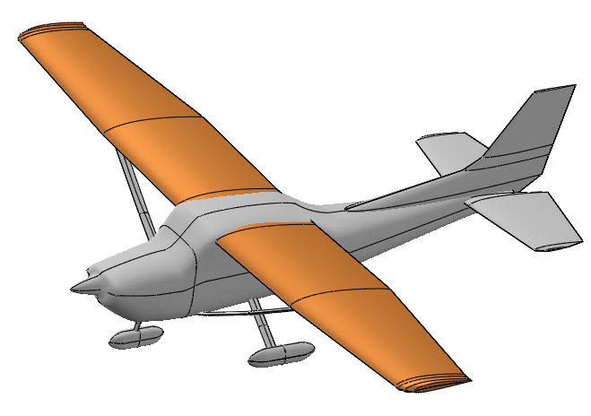

.. _use-case-wingweight:

The Wing weight function
========================

The Wing weight function of Forrester et al. (2008) is a recurrent test case for modeling purpose  and sensitivity analysis in aerospace context. 
This function is extracted and adapted from the Raymer handbook for aircraft design. It is representative of a Cessna C172 Skyhawk wing aircraft.
It depends on the wing area, the weight of fuel in the wing, the aspect ratio, the quarter-chord sweep angle, the dynamic pressure at cruise, the taper ratio,
the airfoil thickness to chord ratio, the ultimate load factor, the flight design gross weight and the paint weight.

The function is defined as follows:

.. math::
   g(S_{w},W_{fw},A, \Lambda, q, \ell, t_c, N_z, W_{dg}, W_p) = 0.036 S_w^{0.758} {W_{fw}}^{0.0035}\left(\frac{A}{\cos^2(\Lambda)}\right)^{0.6} q^{0.006}  \ell^{0.04} \left(\frac{100 t_c}{\cos(\Lambda)}\right)^{-0.3}(N_z W_{dg})^{0.49}+S_w W_p

with:

- :math:`S_w \sim\mathcal{U}(150, 200)`, the wing area (ft^2)

- :math:`W_{fw} \sim\mathcal{U}(220, 300)`,  the weight of fuel in the wing (lb)
		 
- :math:`A : \sim\mathcal{U}(6, 10)`, the aspect ratio (-)
		 
- :math:`\Lambda : \sim\mathcal{U}(-10, 10)`, the quarter-chord sweep angle (deg)
		 
- :math:`q : \sim\mathcal{U}(16, 45)`, the dynamic pressure at cruise (lb/ft^2)

- :math:`\ell : \sim\mathcal{U}(0.5, 1)`, the taper ratio (-)
		 
- :math:`t_c : \sim\mathcal{U}(0.08, 0.18)`, the airfoil thickness to chord ratio (-)
		 
- :math:`N_z : \sim\mathcal{U}(2.5, 6)`, the ultimate load factor (-)
		 
- :math:`W_{dg} : \sim\mathcal{U}(1700, 2500)`, the flight design gross weight (lb)

- :math:`W_p : \sim\mathcal{U}(0.025, 0.08)`, the paint weight (lb/ft^2)

We assume that the input variables are independent.

References
----------

* Forrester, A., Sobester, A., & Keane, A. (2008). Engineering design via surrogate modelling: a practical guide. Wiley.

* Moon, H., Dean, A. M., & Santner, T. J. (2012). Two-stage sensitivity-based group screening in computer experiments. Technometrics, 54(4), 376-387.

* Raymer D.P. (2018). Aircraft Design: a conceptual approach. American Institute of Aeronautics and Astronautics.

API documentation
-----------------

.. currentmodule:: openturns.usecases.wingweight_function

.. autoclass:: WingWeightModel
    :noindex:

Examples based on this use case
-------------------------------

.. minigallery:: openturns.usecases.wingweight_function.WingWeightModel

